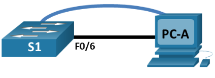
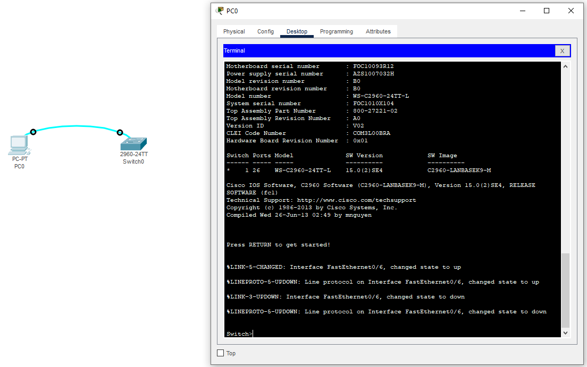
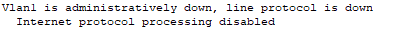
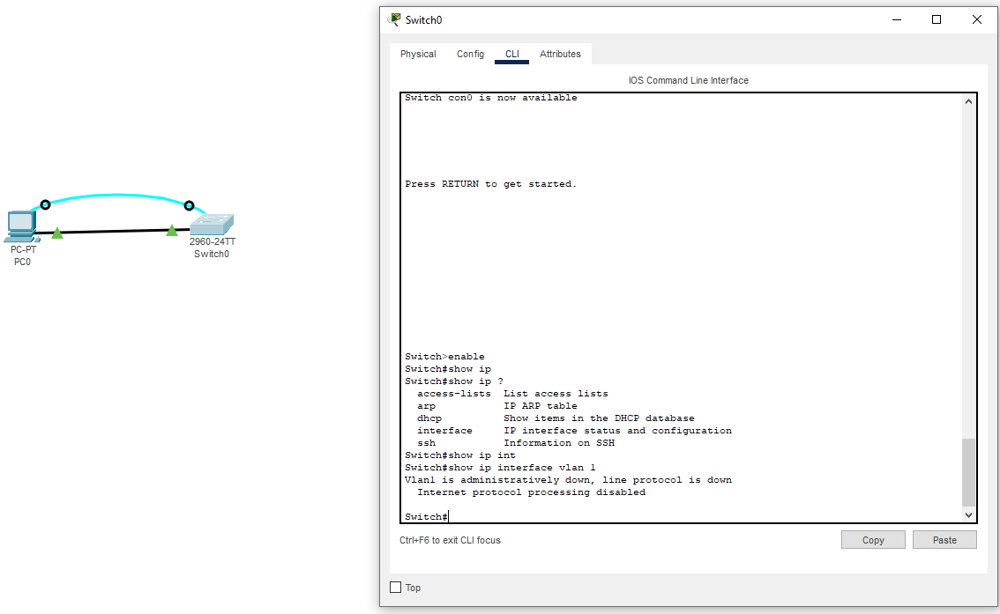
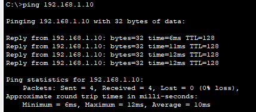
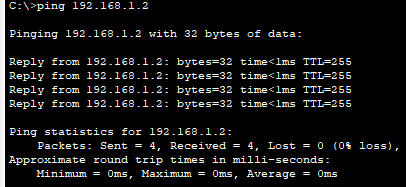

# Лабораторная работа. Базовая настройка коммутатора 

## Топология



## Таблица адресации

| Устройство    | Интерфейс   | IP-адрес / префикс            |
|-----------------|---------------|-------------------------|
| S1    | VLAN 1   | 192.168.1.2 /24  |
| PC-A  | NIC      | 192.168.1.10 /24 |

### Задачи:
Часть 1. Проверка конфигурации коммутатора по умолчанию.

Часть 2. Создание сети и настройка основных параметров устройства
* Настройте базовые параметры коммутатора.
* Настройте IP-адрес для ПК.

Часть 3. Проверка сетевых подключений
* Отобразите конфигурацию устройства.
* Протестируйте сквозное соединение, отправив эхо-запрос.
* Протестируйте возможности удаленного управления с помощью Telnet

## Решение

# Часть 1. Создание сети и проверка настроек коммутатора по умолчанию

Шаг 1:

Топология сети и подключение к коммутатору по средством Terminal



Первоначальная настройка коммутатора осуществляется исключительно через консольный порт, так как у коммутатора отсутствует ip-адрес, что не дает возможности подключиться к нему удаленно используя протоколы ssh и telnet 

Шаг 2:

Ответы на вопросы:

1. Сколько интерфейсов имеется на коммутаторе 2960?
   - 24 FastEthernet порта;
   - 2 Gigabit Ethernet порта;
2. Каков диапазон значений, отображаемых в vty-линиях?
   - 0-15 - диапазон vty-линий.
3. Назначен ли IP-адрес сети VLAN 1?
   - По умолчанию ip-адрес не назначен
4. Какой MAC-адрес имеет SVI?
   - По умолчянию SVI имеет mac-адрес коммутатора. В моём случае это - 00:01:96:C7:19:E3
5. Данный интерфейс включен?
   - Интерфейс выключен
6. IP-свойства интерфейса SVI сети VLAN 1

   

7. Подключение компьютера PC-0 к порту 6 на коммутаторе
  - IP-свойства интерфейса SVI сети VLAN 1 не изменились



8. Под управлением какой версии ОС Cisco IOS работает коммутатор?
  - 15.0(2)SE4
9. Как называется файл образа системы?
  - c2960-lanbasek9-mz.150-2.SE4.bin
10. Cвойства по умолчанию интерфейса FastEthernet0/6
  - Интерфейс включен или выключен?
    - Интерфейс включен
  - Что нужно сделать, чтобы включить интерфейс?
    - Зайти на интерфейс и ввести команду no shutdown
  - Какой MAC-адрес у интерфейса?
    - 0002.1766.9b06
  - Какие настройки скорости и дуплекса заданы в интерфейсе?
    - Full-duplex, 100Mb/s
11. Какое имя присвоено образу Cisco IOS?
  - 2960-lanbasek9-mz.150-2.SE4.bin

# Часть 3. Проверка сетевых подключений

Шаг 1:
   1. Конфигурация коммутатора:
```
Current configuration : 1297 bytes
!
version 15.0
no service timestamps log datetime msec
no service timestamps debug datetime msec
service password-encryption
!
hostname S1
!
enable secret 5 $1$mERr$hx5rVt7rPNoS4wqbXKX7m0
!
!
!
no ip domain-lookup
!
!
!
spanning-tree mode pvst
spanning-tree extend system-id
!
interface FastEthernet0/1
!
interface FastEthernet0/2
!
interface FastEthernet0/3
!
interface FastEthernet0/4
!
interface FastEthernet0/5
!
interface FastEthernet0/6
!
interface FastEthernet0/7
!
interface FastEthernet0/8
!
interface FastEthernet0/9
!
interface FastEthernet0/10
!
interface FastEthernet0/11
!
interface FastEthernet0/12
!
interface FastEthernet0/13
!
interface FastEthernet0/14
!
interface FastEthernet0/15
!
interface FastEthernet0/16
!
interface FastEthernet0/17
!
interface FastEthernet0/18
!
interface FastEthernet0/19
!
interface FastEthernet0/20
!
interface FastEthernet0/21
!
interface FastEthernet0/22
!
interface FastEthernet0/23
!
interface FastEthernet0/24
!
interface GigabitEthernet0/1
!
interface GigabitEthernet0/2
!
interface Vlan1
 ip address 192.168.1.2 255.255.255.0
!
banner motd ^C
Unauthorized access is strictly prohibited.
^C
!
!
!
line con 0
 password 7 0822455D0A16
 login
!
line vty 0 4
 password 7 0822455D0A16
 login
line vty 5 15
 password 7 0822455D0A16
 login
!
!
!
!
end
```
   2. Какова полоса пропускания интерфейса vlan 1
      - 100000 Kbit

Шаг 2:

   1. Связь с адресом PC0


   
   2. Связь с адресом S1



Шаг 3:

   Подключение через telnet
   
