# Лабораторная работа. Настройка и проверка расширенных списков контроля доступа.

## Топопология

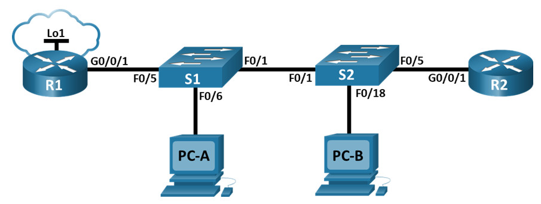

## Таблица адресации

| Устройство    | Интерфейс   | IP-адрес  | Маска подсети | Шлюз по умолчанию |
|-----------------|---------------|-------------------------|-------------------|---------|
| R1 | G0/0/1   | -  |   -   | - |
| R1 | G0/0/1.20   | 10.20.0.1|    255.255.255.0  | - |
| R1 | G0/0/1.30   | 10.30.0.1|    255.255.255.0  | - |
| R1 | G0/0/1.40 | 10.40.0.1 |   255.255.255.0  | - |
| R1 | G0/0/1.1000     | - |    -  | - |
| R1 | Loopback1      | 172.16.1.1 |    255.255.255.0  | - |
| R2 | G0/0/1      | 10.20.0.4 |    255.255.255.0  | - |
| S1 | VLAN 20     | 10.20.0.2 |    255.255.255.0  | 10.20.0.1 |
| S2 | VLAN 20      | 10.20.0.3 |    255.255.255.0  | 10.20.0.1 |
| PC-A | NIC     | 10.30.0.10 |    255.255.255.0  | 10.30.0.1 |
| PC-B | NIC      | 10.40.0.10 |    255.255.255.0  | 10.40.0.1 |

## Таблица VLAN

| VLAN   | Имя   | Назаначение интерфейса  |
|-----------------|---------------|-------------------------|
| 20 | Management   | S2: F0/5   |
| 30 | Operations   | S1: F0/6  |
| 40 | Sales  | S2: F0/18 |
| 999 | ParkingLot   | S1: F0/2-4, F0/7-24, G0/1-2 |
| 999 | ParkingLot   | S2: F0/2-4, F0/6-17, F0/19-24, G0/1-2| 
| 1000 | Собственная | - |

### Задачи

Часть 1. Создание сети и настройка основных параметров устройства

Часть 2. Настройка и проверка списков расширенного контроля доступа

## Решение

# Часть 1. Создание сети и настройка основных параметров устройства

## Шаг 1. Создайте сеть согласно топологии.

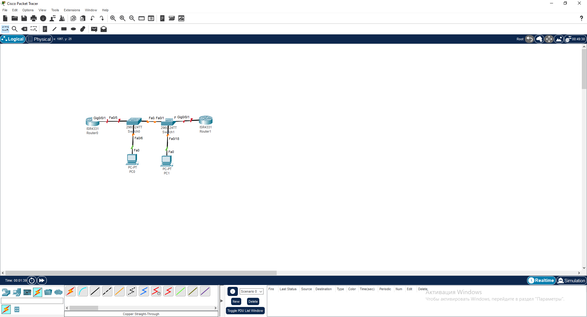

## Шаг 2. Произведите базовую настройку маршрутизаторов.

Настройку произвел как и в предыдущих практических работах 

## Шаг 3. Настройте базовые параметры каждого коммутатора.

Настройку произвел как и в предыдущих практических работах 

# Часть 2. Настройка сетей VLAN на коммутаторах.

## Шаг 1. Создайте сети VLAN на коммутаторах.

* Создайте необходимые VLAN и назовите их на каждом коммутаторе из приведенной выше таблицы.

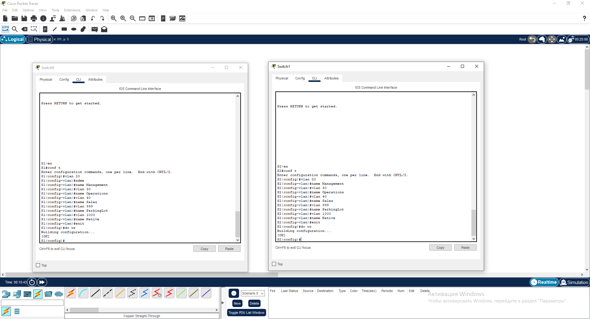

* Настройте интерфейс управления и шлюз по умолчанию на каждом коммутаторе, используя информацию об IP-адресе в таблице адресации.

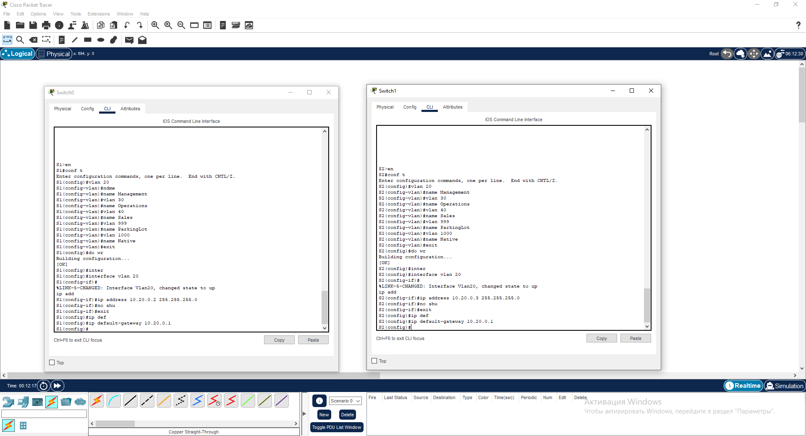

* Назначьте все неиспользуемые порты коммутатора VLAN Parking Lot, настройте их для статического режима доступа и административно деактивируйте их.

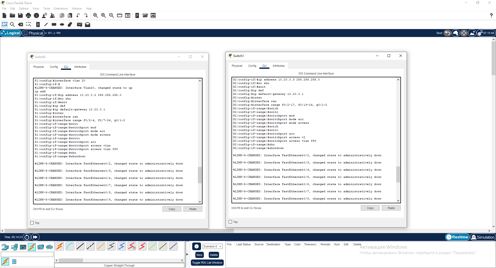

## Шаг 2. Назначьте сети VLAN соответствующим интерфейсам коммутатора.

* Назначьте используемые порты соответствующей VLAN (указанной в таблице VLAN выше) и настройте их для режима статического доступа.

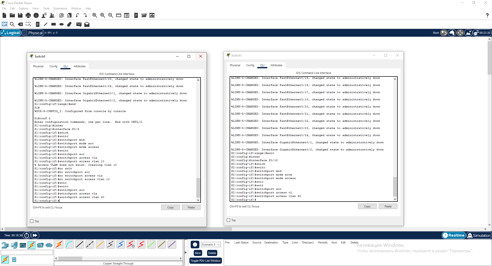

* Выполните команду show vlan brief, чтобы убедиться, что сети VLAN назначены правильным интерфейсам.

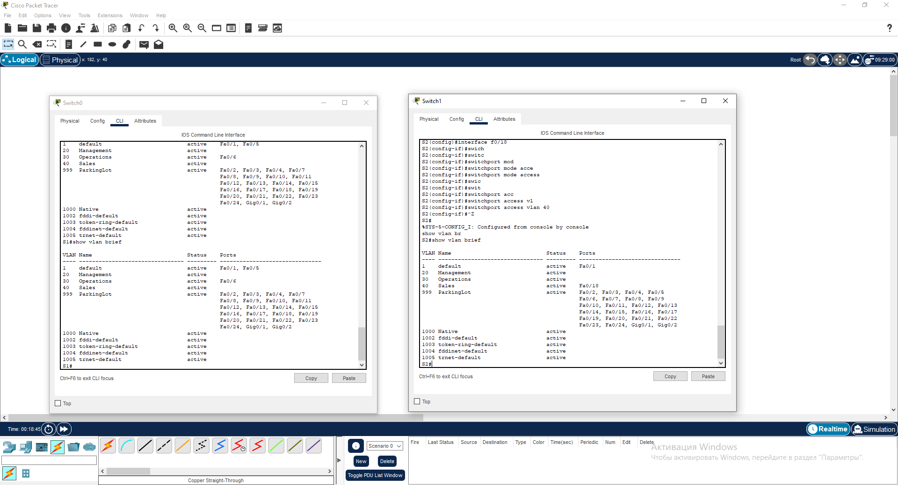

# Часть 3. Настройте транки (магистральные каналы).

## Шаг 1. Вручную настройте магистральный интерфейс F0/1.

* Измените режим порта коммутатора на интерфейсе F0/1, чтобы принудительно создать магистральную связь. Не забудьте сделать это на обоих коммутаторах.

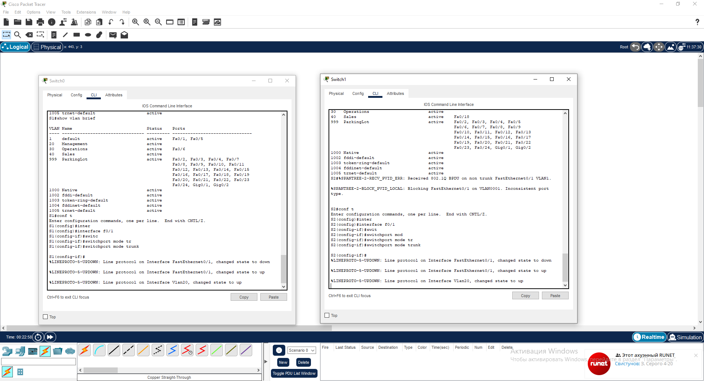

* В рамках конфигурации транка установите для native vlan значение 1000 на обоих коммутаторах. При настройке двух интерфейсов для разных собственных VLAN сообщения об ошибках могут отображаться временно.

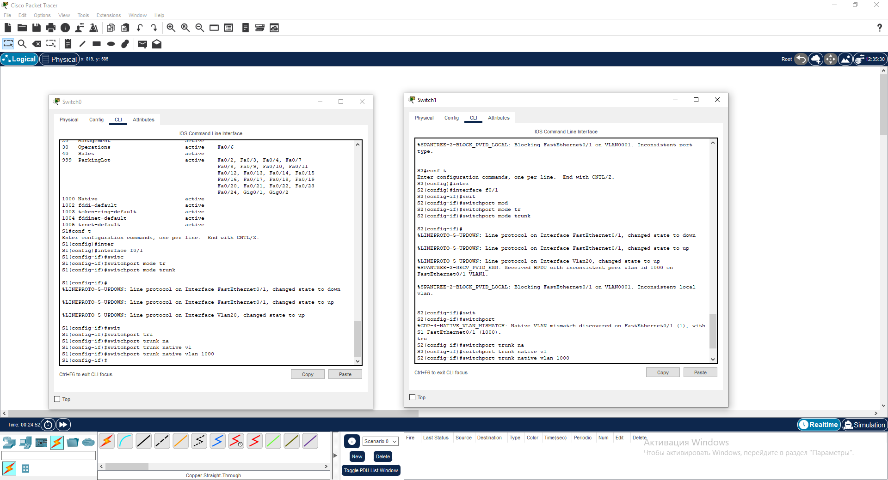

* В качестве другой части конфигурации транка укажите, что VLAN 10, 20, 30 и 1000 разрешены в транке.

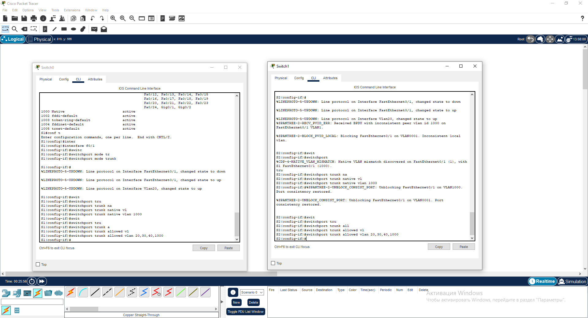

* Выполните команду show interfaces trunk для проверки портов магистрали, собственной VLAN и разрешенных VLAN через магистраль.

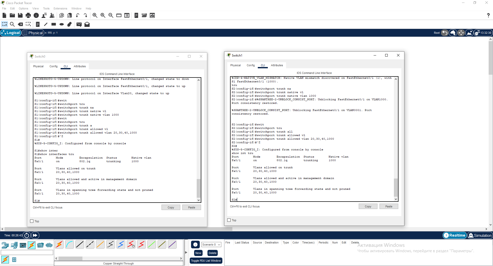

## Шаг 2. Вручную настройте магистральный интерфейс F0/5 на коммутаторе S1.

* Настройте интерфейс S1 F0/5 с теми же параметрами транка, что и F0/1. Это транк до маршрутизатора.

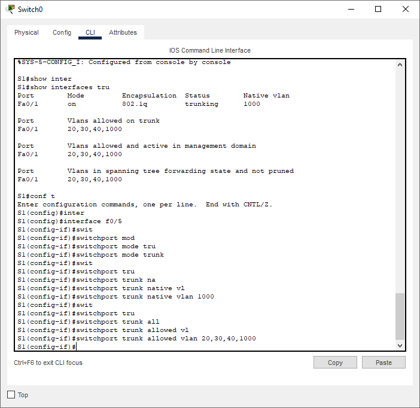

# Часть 4. Настройте маршрутизацию.

## Шаг 1. Настройка маршрутизации между сетями VLAN на R1.

* Активируйте интерфейс G0/0/1 на маршрутизаторе.

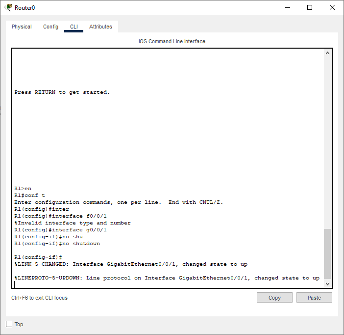

* Настройте подинтерфейсы для каждой VLAN, как указано в таблице IP-адресации. Все подинтерфейсы используют инкапсуляцию 802.1Q. Убедитесь, что подинтерфейс для собственной VLAN не имеет назначенного IP-адреса. Включите описание для каждого подинтерфейса.

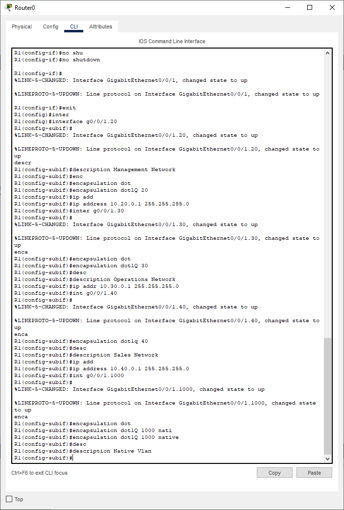

* Настройте интерфейс Loopback 1 на R1 с адресацией из приведенной выше таблицы.

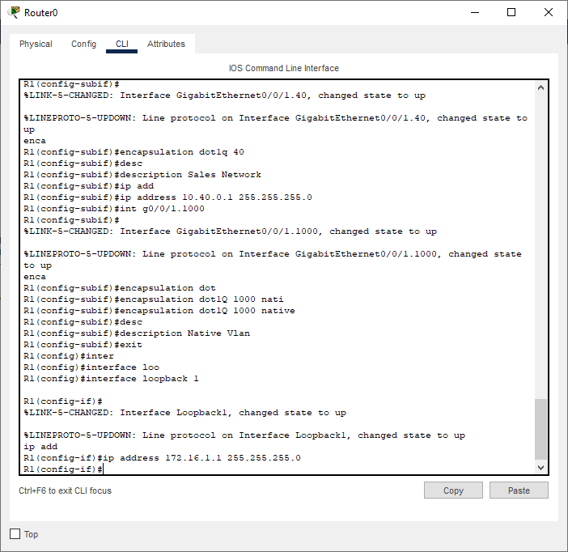

* С помощью команды show ip interface brief проверьте конфигурацию подынтерфейса.

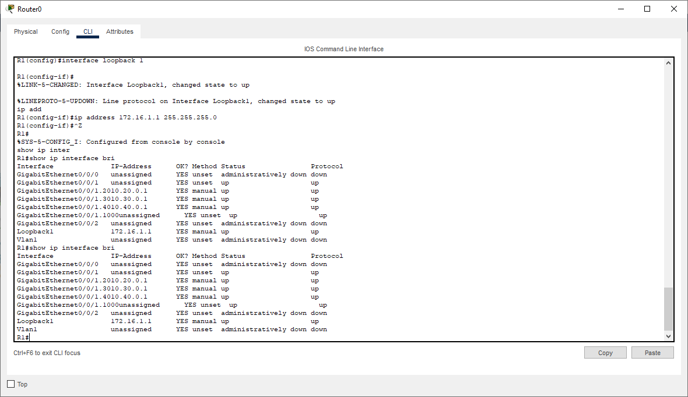

## Шаг 2. Настройка интерфейса R2 g0/0/1 с использованием адреса из таблицы и маршрута по умолчанию с адресом следующего перехода 10.20.0.1

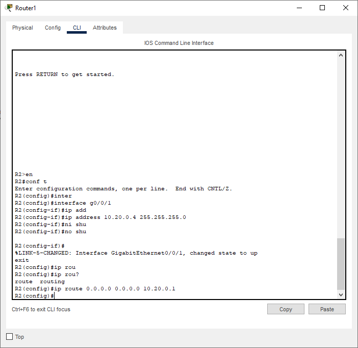

