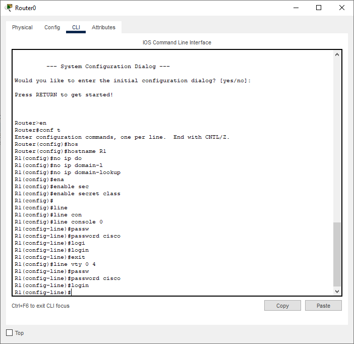

# Лабораторная работа - Настройка NAT для IPv4

## Топопология

## Таблица адресации

| Устройство    | Интерфейс   | IP-адрес  | Маска подсети |
|-----------------|---------------|-------------------------|-------------------|
| R1 | G0/0/0  | 209.165.200.230 |   255.255.255.248   | 
| R1 | G0/0/1  | 192.168.1.1 |    255.255.255.0  |
| R2 | G0/0/0   | 209.165.200.225 |    255.255.255.248  |
| R2 | Lo1 | 209.165.200.1 |    255.255.255.224  |
| S1 | VLAN 1     | 192.168.1.11 |    255.255.255.0  | 
| S2 | VLAN 1     | 192.168.1.12 |    255.255.255.0  | 
| PC-A | NIC      | 192.168.1.2 |    255.255.255.0  | 
| PC-B | NIC      | 192.168.1.3 |    255.255.255.0  | 

### Задачи

Часть 1. Создание сети и настройка основных параметров устройства

Часть 2. Настройка и проверка NAT для IPv4

Часть 3. Настройка и проверка PAT для IPv4

Часть 4. Настройка и проверка статического NAT для IPv4.

## Решение

# Часть 1. Создание сети и настройка основных параметров устройства

## Шаг 1. Подключите кабели сети согласно приведенной топологии.

## Шаг 2. Произведите базовую настройку маршрутизаторов.

* Назначьте маршрутизатору имя устройства.

* Отключите поиск DNS, чтобы предотвратить попытки маршрутизатора неверно преобразовывать введенные команды таким образом, как будто они являются именами узлов.

* Назначьте class в качестве зашифрованного пароля привилегированного режима EXEC.

* Назначьте cisco в качестве пароля консоли и включите вход в систему по паролю.

* Назначьте cisco в качестве пароля VTY и включите вход в систему по паролю.

* Зашифруйте открытые пароли.

* Создайте баннер с предупреждением о запрете несанкционированного доступа к устройству.

* Настройте IP-адресации интерфейса, как указано в таблице выше.

* Настройте маршрут по умолчанию. от R2 до  R1.

* Сохраните текущую конфигурацию в файл загрузочной конфигурации.

На R2 были произведены теже настройки, поменялись только ip-адреса!

## Шаг 3. Настройте базовые параметры каждого коммутатора.

* Присвойте коммутатору имя устройства.

* Отключите поиск DNS, чтобы предотвратить попытки маршрутизатора неверно преобразовывать введенные команды таким образом, как будто они являются именами узлов.

* Назначьте class в качестве зашифрованного пароля привилегированного режима EXEC.

* Назначьте cisco в качестве пароля консоли и включите вход в систему по паролю.

* Назначьте cisco в качестве пароля VTY и включите вход в систему по паролю.

* Зашифруйте открытые пароли.

* Создайте баннер с предупреждением о запрете несанкционированного доступа к устройству.

* Выключите все интерфейсы, которые не будут использоваться.

* Настройте IP-адресации интерфейса, как указано в таблице выше.

* Сохраните текущую конфигурацию в файл загрузочной конфигурации.

На S2 были произведены теже настройки, поменялись только ip-адреса и были заглушены другие порты!

# Часть 2. Настройка и проверка NAT для IPv4.

## Шаг 1. Настройте NAT на R1, используя пул из трех адресов 209.165.200.226-209.165.200.228.

* Настройте простой список доступа, который определяет, какие хосты будут разрешены для трансляции. В этом случае все устройства в локальной сети R1 имеют право на трансляцию.

* Создайте пул NAT и укажите ему имя и диапазон используемых адресов.

* Настройте перевод, связывая ACL и пул с процессом преобразования.

* Задайте внутренний (inside) интерфейс.

* Определите внешний (outside) интерфейс.

## Шаг 2. Проверка конфигурации.

* С PC-B,  запустите эхо-запрос интерфейса Lo1 (209.165.200.1) на R2. Если эхо-запрос не прошел, выполните процес поиска и устранения неполадок. На R1 отобразите таблицу NAT на R1 с помощью команды show ip nat translations.

Во что был транслирован внутренний локальный адрес PC-B? - 209.165.200.226

Какой тип адреса NAT является переведенным адресом? - Inside Global

* С PC-A, запустите  эхо-запрос интерфейса Lo1 (209.165.200.1) на R2. Если эхо-запрос не прошел, выполните отладку. На R1 отобразите таблицу NAT на R1 с помощью команды show ip nat translations.

* Обратите внимание, что предыдущая трансляция для PC-B все еще находится в таблице. Из S1, эхо-запрос интерфейса Lo1 (209.165.200.1) на R2. Если эхо-запрос не прошел, выполните отладку. На R1 отобразите таблицу NAT на R1 с помощью команды show ip nat translations.

* Теперь запускаем пинг R2 Lo1 из S2. На этот раз перевод завершается неудачей, и вы получаете эти сообщения (или аналогичные) на консоли R1:

* Это ожидаемый результат, потому что выделено только 3 адреса, и мы попытались ping Lo1 с четырех устройств. Напомним, что NAT — это трансляция «один-в-один». Как много выделено трансляций? Введите команду show ip nat translations verbose , и вы увидите, что ответ будет 24 часа.

В cpt данная команда отсутствует

* Учитывая, что пул ограничен тремя адресами, NAT для пула адресов недостаточно для нашего приложения. Очистите преобразование NAT и статистику, и мы перейдем к PAT.

clear ip nat statistics - Команда отсутствует в cpt

# Часть 3. Настройка и проверка PAT для IPv4.

## Шаг 1. Удалите команду преобразования на R1.

## Шаг 2. Добавьте команду PAT на R1.

## Шаг 3. Протестируйте и проверьте конфигурацию.

