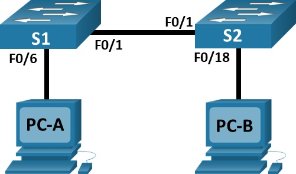
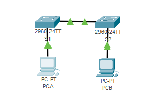
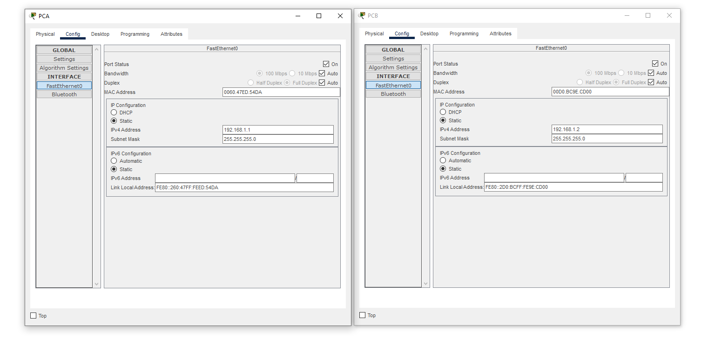
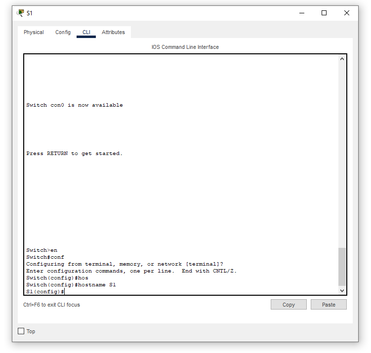
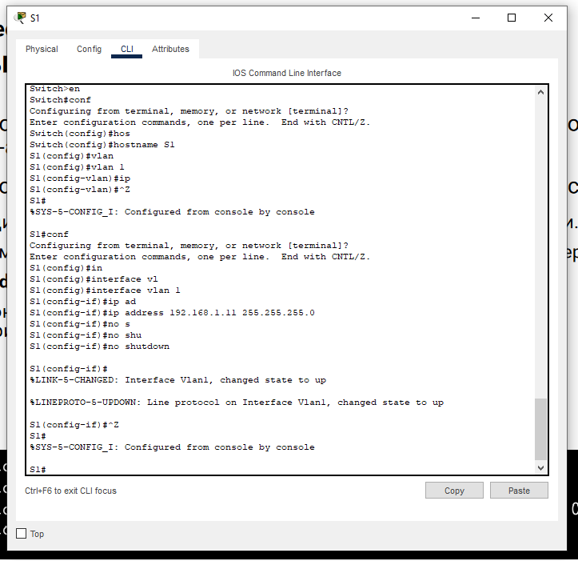
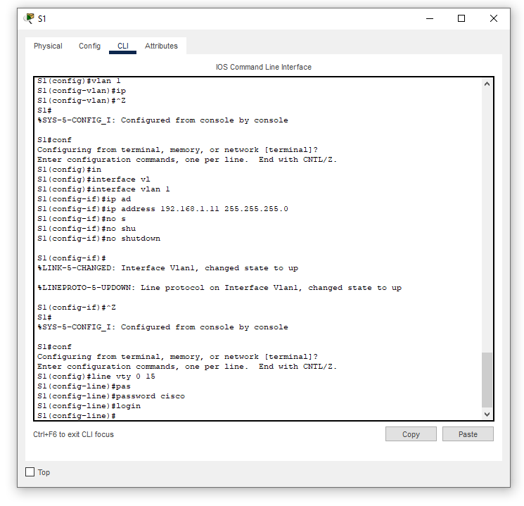
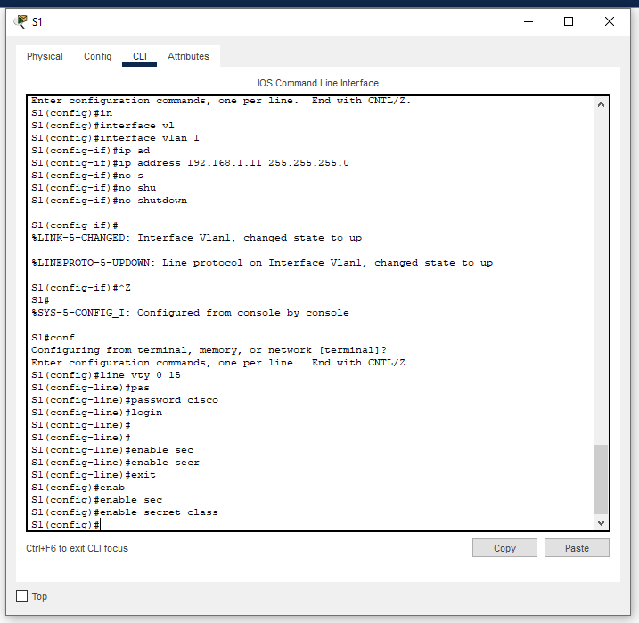
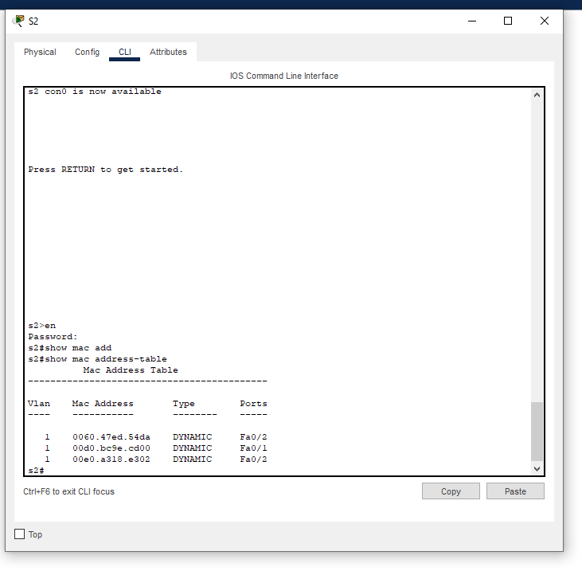
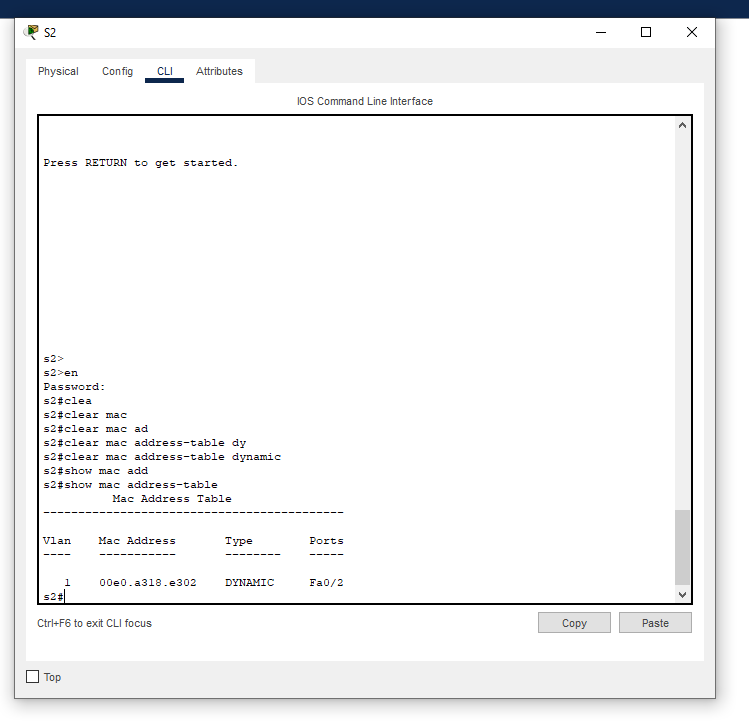

# Лабораторная работа. Просмотр таблицы MAC-адресов коммутатора

## Топология

## Таблица адресации

| Устройство    | Интерфейс   | IP-адрес  | Маска подсети | 
|-----------------|---------------|-------------------------|-------------------|
| S1 | VLAN 1   | 192.168.1.11  |   255.255.255.0   |
| S2 | VLAN 1   | 192.168.1.12 |    255.255.255.0  |
| PC-A | NIC      | 192.168.1.1 |    255.255.255.0  |
| PC-B | NIC      | 192.168.1.2 |    255.255.255.0  |

### Цели
Часть 1. Создание и настройка сети

Часть 2. Изучение таблицы МАС-адресов коммутатора

## Решение

# Часть 1. Создание и настройка сети

## Шаг 1: Подключение узлов в соответствие с топологией

## Шаг 2: Настройка узлов ПК

## Шаг3: Настройка базовых параметров коммутатора
* Настройка имени устройства
  

* Настройка ip-адреса
  

* Назначение паролей VTY
  

* Назначение пароля к режиму EXEC
  

# Часть 2. Изучение таблицы МАС-адресов коммутатора

## Шаг 1: МАС-адреса сетевых устройств

* PC-A: 0060.47ED.54DA
* PC-B: 00D0.BC9E.CD00
* S1 Fast Ethernet 0/1: 00e0.a318.e301 (bia 00e0.a318.e301)
* S2 Fast Ethernet 0/1: 0060.4784.9d01 (bia 0060.4784.9d01)

## Шаг 2: Просмотр таблицы МАС-адресов коммутатора.

### Вопросы:

Ответы на все нижестоящие вопросы произведены после отправки эхо запроса с PC-A на PC-B

1. Записаны ли в таблице МАС-адресов какие-либо МАС-адреса?
   - В таблице MAC-адрессов коммутатора S2 имееться 3 запись
2. Какие МАС-адреса записаны в таблице? С какими портами коммутатора они сопоставлены и каким устройствам принадлежат?
   - В таблице MAC-адрессов коммутатора содержатся MAC-адресса конечных устройств(PC-A и PC-B) и адрес порта соседнего коммутатора
3. Если вы не записали МАС-адреса сетевых устройств в шаге 1, как можно определить, каким устройствам принадлежат МАС-адреса, используя только выходные данные команды show mac address-table? Работает ли это решение в любой ситуации?
   - Максимум что можно определить используя команду show mac address-table, так это порт с которого подключено устройство, тем самым можно будет понять какое именно устройство находится за портом. Данный метод не сработает если через 1 порт транслируется сразу несколько MAC-адрессов.

## Шаг 3: Очистка таблицы МАС-адресов коммутатора S2 и отображение таблицы МАС-адресов.

### Вопросы:

1. Указаны ли в таблице МАС-адресов адреса для VLAN 1? 
   - Да
2. Указаны ли другие МАС-адреса?
   - Нет
3. Через 10 секунд введите команду show mac address-table и нажмите клавишу ввода. Появились ли в таблице МАС-адресов новые адреса?
   - Новые адреса не пояляются

## Шаг 4: Отправка эхо-запросов по сети и просмотр таблицы MAC-адресов коммутатора.

1. На компьютере PC-B откройте командную строку и введите команду arp -a.

### Вопрос:

Не считая адресов многоадресной и широковещательной рассылки, сколько пар IP- и МАС-адресов устройств было получено через протокол ARP?
* Всего была получена пара адресов отвечающая за PC-A (так как ранее был произведен эхо запрос)

2. Из командной строки PC-B отправьте эхо-запросы на компьютер PC-A, а также коммутаторы S1 и S2.

### Вопрос:

От всех ли устройств получены ответы?
* Да

3. Подключившись через консоль к коммутатору S2, введите команду show mac address-table

### Вопрос:

Добавил ли коммутатор в таблицу МАС-адресов дополнительные МАС-адреса? Если да, то какие адреса и устройства?
   * Теперь входят адреса PC-B, PC-A разных подключений fastethernet
     
4. На компьютере PC-B откройте командную строку и еще раз введите команду arp -a.

### Вопрос:

Появились ли в ARP-кэше компьютера PC-B дополнительные записи для всех сетевых устройств, которым были отправлены эхо-запросы?
* Да, появились
