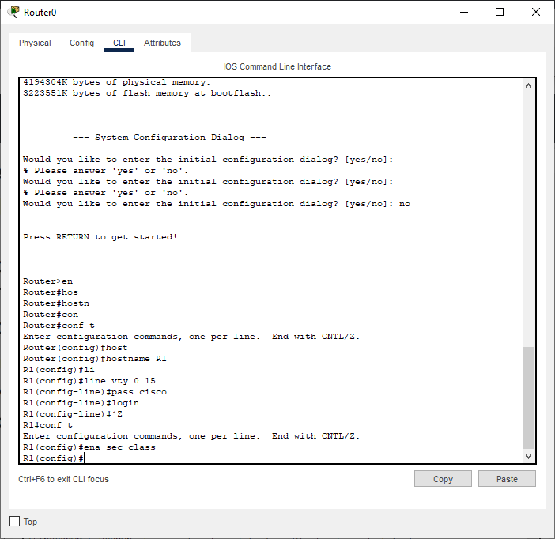
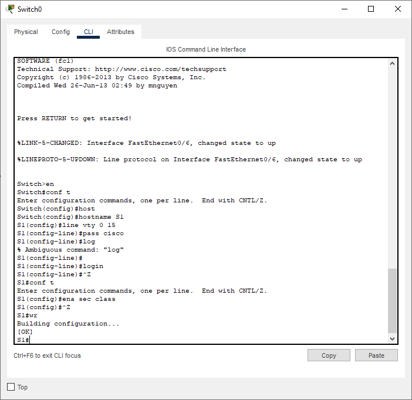
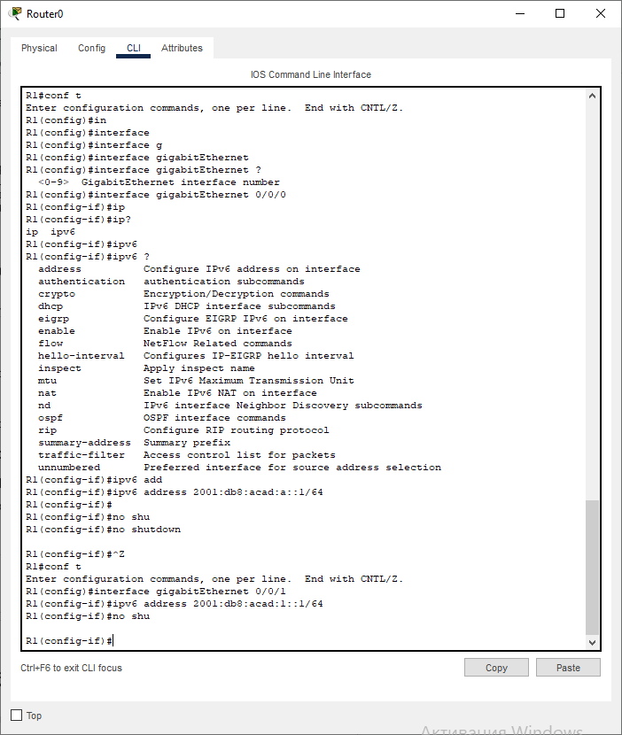
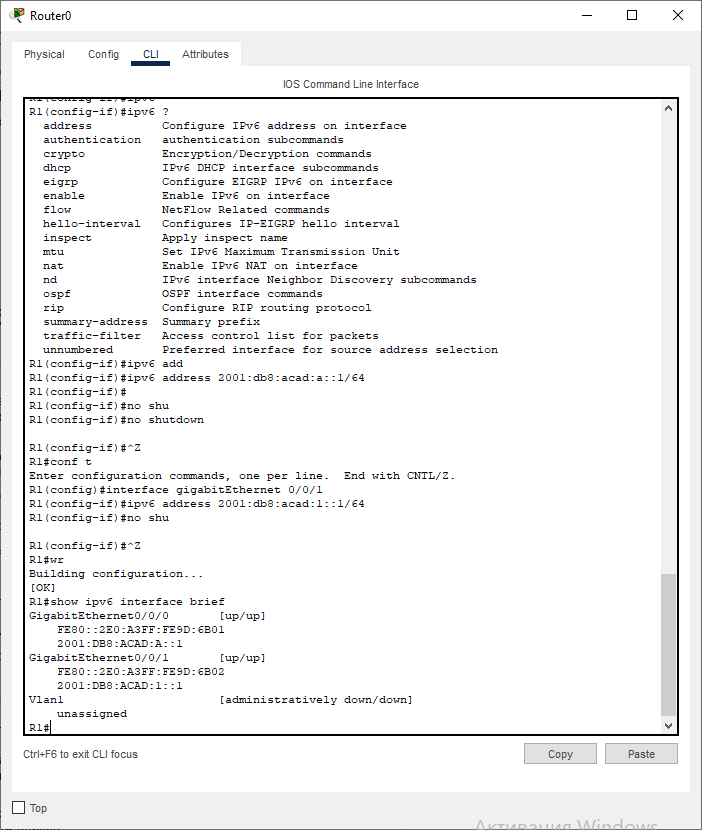
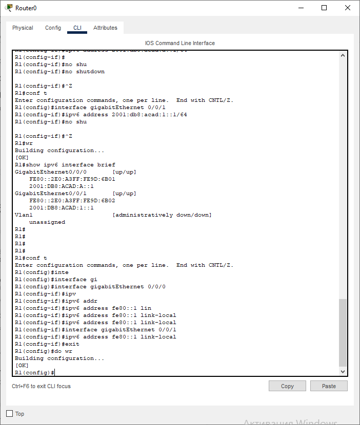
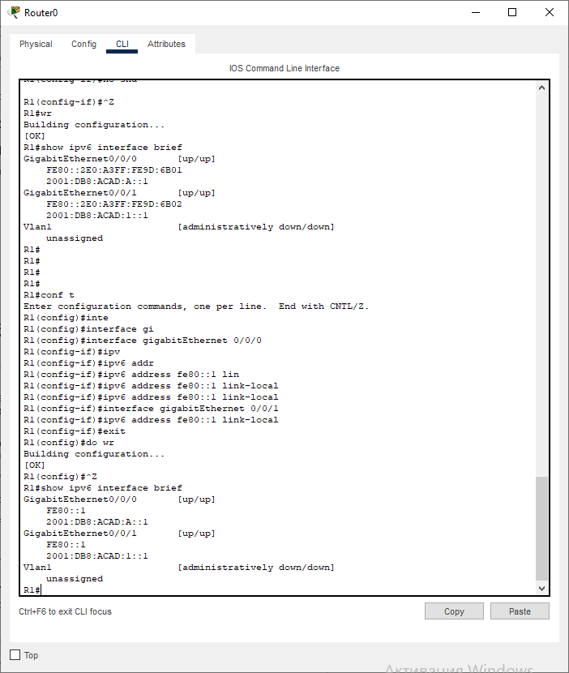
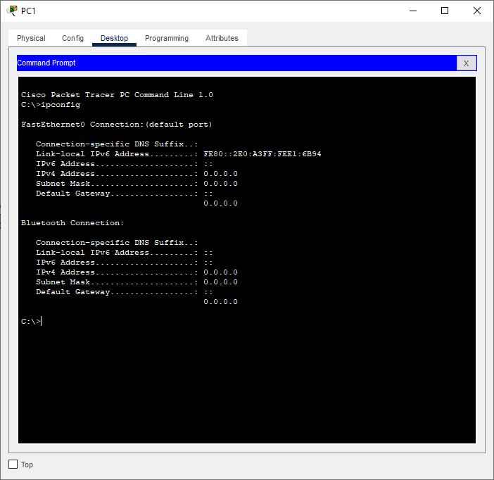
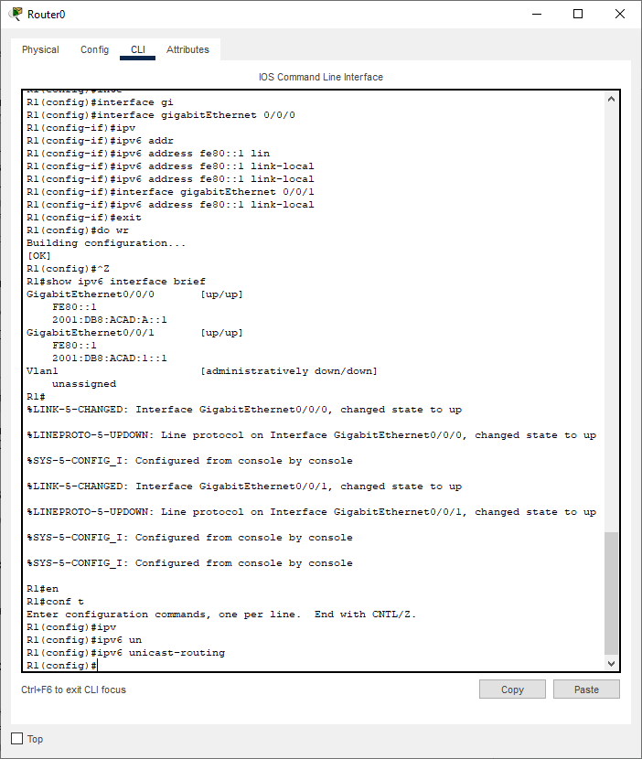
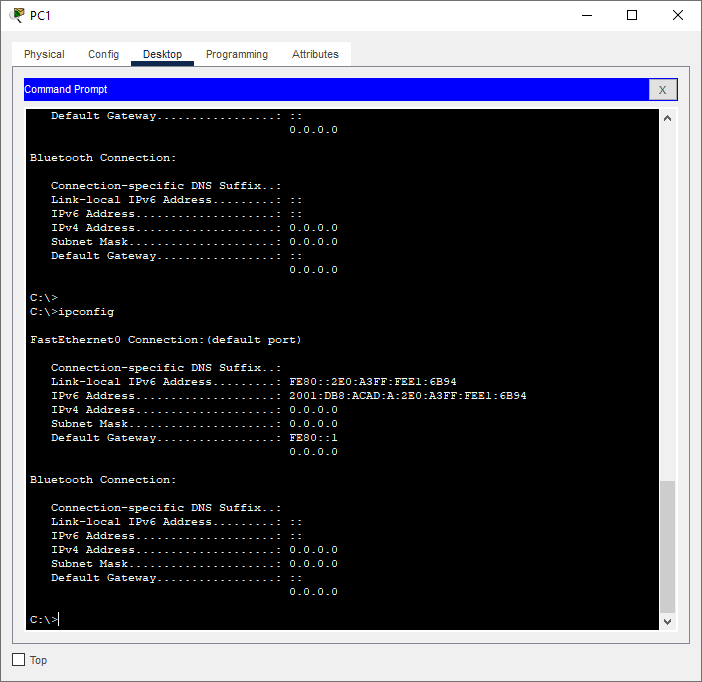

# Лабораторная работа. Настройка IPv6-адресов на сетевых устройствах

## Топология

## Таблица адресации

| Устройство    | Интерфейс   | IPv6-адрес  | Link local IPv6-адрес | Длинна префикса | Шлюз по умолчанию |
|-----------------|---------------|-------------------------|-------------------|---------|-------------|
| R1 | G0/0/0   | 2001:db8:acad:a::1  |   fe80::1  | 64 | - |
| R1 | G0/0/1  | 2001:db8:acad:1::1 |    fe80::1  | 64 | - |
| S1 | VLAN 1   | 2001:db8:acad:1::b |    fe80::b  | 64 | - |
| PC-A | NIC      | 2001:db8:acad:1::3 |    SLACC  | 64 | fe80::1 |
| PC-B | NIC      | 2001:db8:acad:a::3 |    SLACC | 64 | fe80::1 |

### Задачи 
Часть 1. Настройка топологии и конфигурация основных параметров маршрутизатора и коммутатора

Часть 2. Ручная настройка IPv6-адресов

Часть 3. Проверка сквозного соединения

## Решение 

# Часть 1. Настройка топологии и конфигурация основных параметров маршрутизатора и коммутатора

## Шаг 1. Настройка базовых параметров маршрутизатора.

## Шаг 2. Настройка базовых параметров коммутатора.

## Часть 2. Ручная настройка IPv6-адресов

## Шаг 1. Назначьте IPv6-адреса интерфейсам Ethernet на R1.

* Назначьте глобальные индивидуальные IPv6-адреса, указанные в таблице адресации обоим интерфейсам Ethernet на R1.

* Введите команду show ipv6 interface brief, чтобы проверить, назначен ли каждому интерфейсу корректный индивидуальный IPv6-адрес.

* Чтобы обеспечить соответствие локальных адресов канала индивидуальному адресу, вручную введите локальные адреса канала на каждом интерфейсе Ethernet на R1.

* Используйте выбранную команду, чтобы убедиться, что локальный адрес связи изменен на fe80::1.

## Шаг 2. Активируйте IPv6-маршрутизацию на R1.

* В командной строке на PC-B введите команду ipconfig, чтобы получить данные IPv6-адреса, назначенного интерфейсу ПК.

* Назначен ли индивидуальный IPv6-адрес сетевой интерфейсной карте (NIC) на PC-B? 

Да назначен

* Активируйте IPv6-маршрутизацию на R1 с помощью команды IPv6 unicast-routing.

* Теперь, когда R1 входит в группу многоадресной рассылки всех маршрутизаторов, еще раз введите команду ipconfig на PC-B. Проверьте данные IPv6-адреса.

* Почему PC-B получил глобальный префикс маршрутизации и идентификатор подсети, которые вы настроили на R1?

Из-за функции SLAAC
