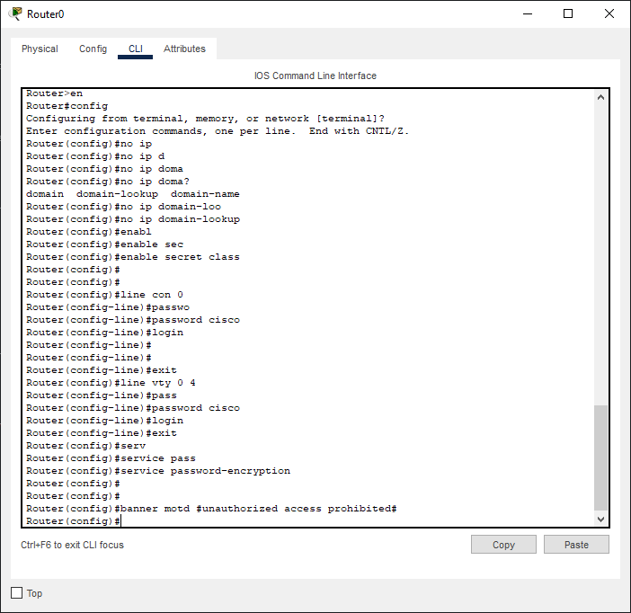

# Лабораторная работа. Доступ к сетевым устройствам по протоколу SSH

## Топология

## Таблица адресации

| Устройство    | Интерфейс   | IP-адрес  | Маска подсети | Шлюз по умолчанию |
|-----------------|---------------|-------------------------|-------------------|---------|
| R1 | G0/0/1   | 192.168.1.1  |   255.255.255.0   | - |
| S1 | VLAN 1   | 192.168.1.11 |    255.255.255.0  | 192.168.1.1 |
| PC-A | NIC      | 192.168.1.3 |    255.255.255.0  | 192.168.1.1 |

### Задачи

Часть 1. Настройка основных параметров устройства

Часть 2. Настройка маршрутизатора для доступа по протоколу SSH

Часть 3. Настройка коммутатора для доступа по протоколу SSH

Часть 4. SSH через интерфейс командной строки (CLI) коммутатора

## Решение

# Часть 1. Настройка основных параметров устройств

## Шаг 1. Настройка маршрутизатора.

* Отключите поиск DNS, чтобы предотвратить попытки маршрутизатора неверно преобразовывать введенные команды таким образом, как будто они являются именами узлов.

* Назначьте class в качестве зашифрованного пароля привилегированного режима EXEC.

* Назначьте cisco в качестве пароля консоли и включите вход в систему по паролю.

* Назначьте cisco в качестве пароля VTY и включите вход в систему по паролю.

* Зашифруйте открытые пароли.

* Создайте баннер, который предупреждает о запрете несанкционированного доступа.

* Настройте и активируйте на маршрутизаторе интерфейс G0/0/1, используя информацию, приведенную в таблице адресации

* Сохраните текущую конфигурацию в файл загрузочной конфигурации.

## Шаг 2. Настройте компьютер PC-A.

* Настройте для PC-A IP-адрес и маску подсети.

* Настройте для PC-A шлюз по умолчанию.

## Шаг 3. Проверьте подключение к сети.

* Пошлите с PC-A команду Ping на маршрутизатор R1.

