# Лабораторная работа - Внедрение маршрутизации между виртуальными локальными сетями

## Топопология

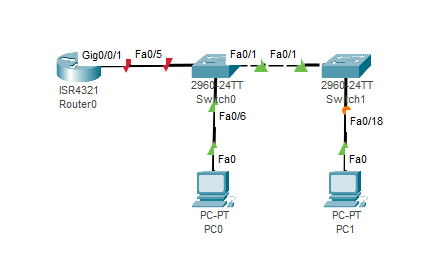

## Таблица адресации

| Устройство    | Интерфейс   | IP-адрес  | Маска подсети | Шлюз по умолчанию |
|-----------------|---------------|-------------------------|-------------------|---------|
| R1 | G0/0/1.10   | 192.168.10.1  |   255.255.255.0   | - |
| R1 | G0/0/1.20   | 192.168.20.1 |    255.255.255.0  | - |
| R1 | G0/0/1.30   | 192.168.30.1|    255.255.255.0  | - |
| R1 | G0/0/1.1000 | - |    -  | - |
| S1 | VLAN 10      | 192.168.10.11 |    255.255.255.0  | 192.168.10.1 |
| S2 | VLAN 10      | 192.168.10.12 |    255.255.255.0  | 192.168.10.1 |
| PC-A | NIC      | 192.168.20.3 |    255.255.255.0  | 192.168.20.1 |
| PC-B | NIC      | 192.168.30.3 |    255.255.255.0  | 192.168.30.1 |

## Таблица VLAN

| VLAN   | Имя   | Назаначение интерфейса  |
|-----------------|---------------|-------------------------|
| 10 | Управление   | S1: VLAN 10   |
| 10 | Управление   | S2: VLAN 10  |
| 20 | Sales  | S1: F0/6 |
| 30 | Operations   | S2: F0/18| 
| 999 | Parking_Lot | S1: F0/2-4, F0/7-24, G0/1-2 |
| 999 | Parking_Lot | S2: F0/2-17, F0/19-24, G0/1-2 |
| 1000 | Собственное      | - |

### Задачи

Часть 1. Создание сети и настройка основных параметров устройства

Часть 2. Создание сетей VLAN и назначение портов коммутатора

Часть 3. Настройка транка 802.1Q между коммутаторами

Часть 4. Настройка маршрутизации между сетями VLAN

Часть 5. Проверка, что маршрутизация между VLAN работает

## Решение

# Часть 1. Создание сети и настройка основных параметров устройства

## Шаг 1. Создайте сеть согласно топологии.

## Шаг 2. Настройте базовые параметры для маршрутизатора.

* Назначьте маршрутизатору имя устройства.

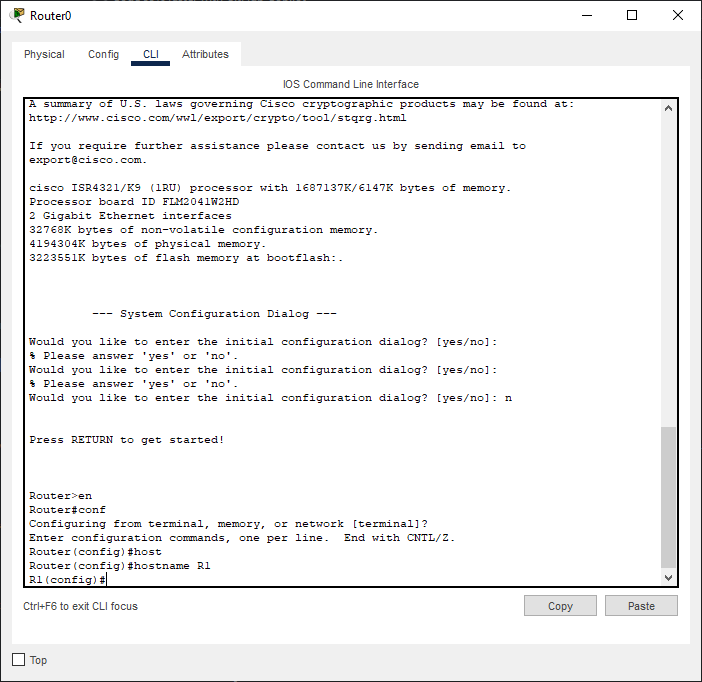

* Отключите поиск DNS, чтобы предотвратить попытки маршрутизатора неверно преобразовывать введенные команды таким образом, как будто они являются именами узлов.

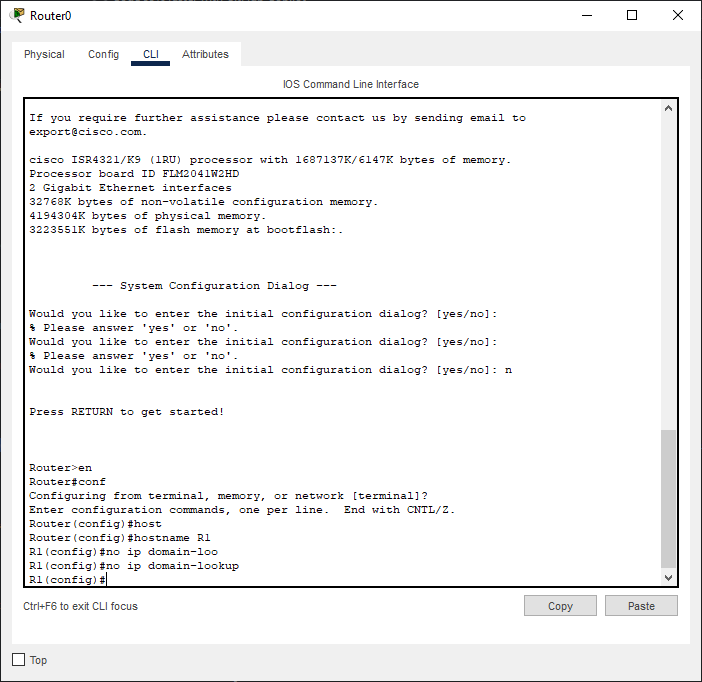

* Назначьте class в качестве зашифрованного пароля привилегированного режима EXEC.

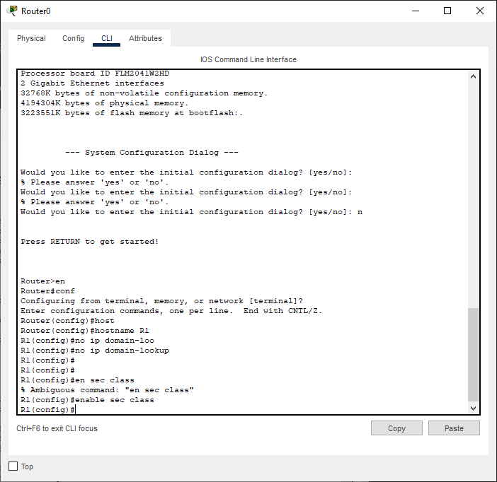

* Назначьте cisco в качестве пароля консоли и включите вход в систему по паролю.

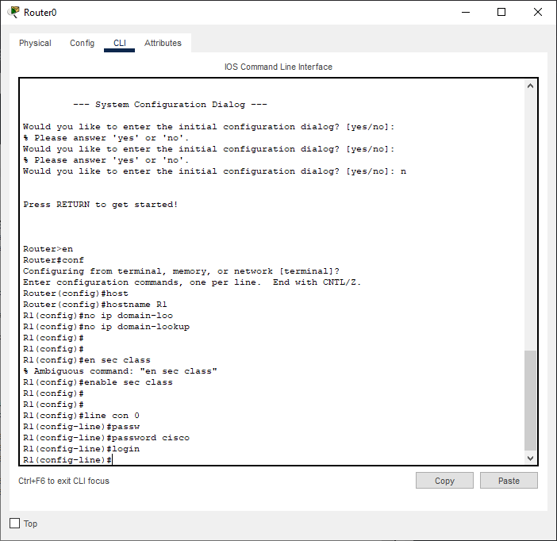

* Установите cisco в качестве пароля виртуального терминала и активируйте вход.

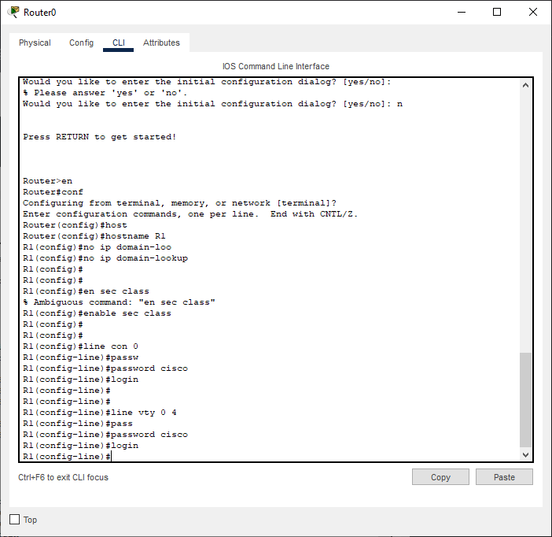

* Зашифруйте открытые пароли.

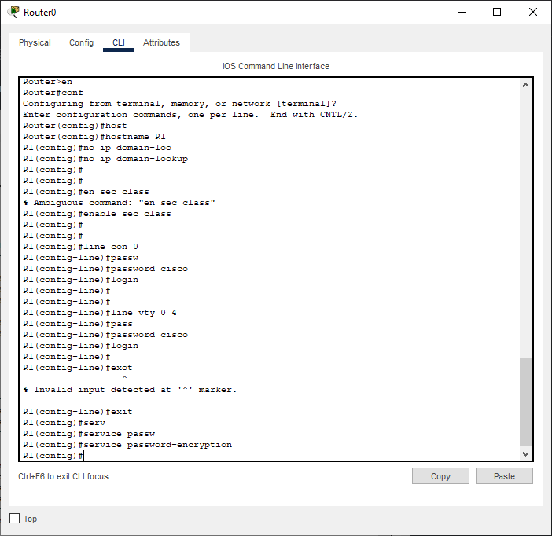

* Создайте баннер с предупреждением о запрете несанкционированного доступа к устройству.

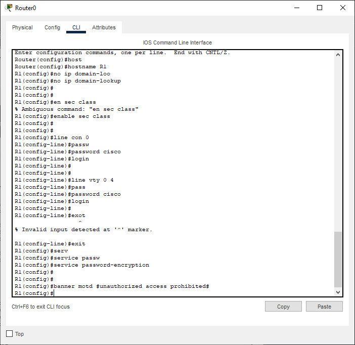

* Сохраните текущую конфигурацию в файл загрузочной конфигурации.

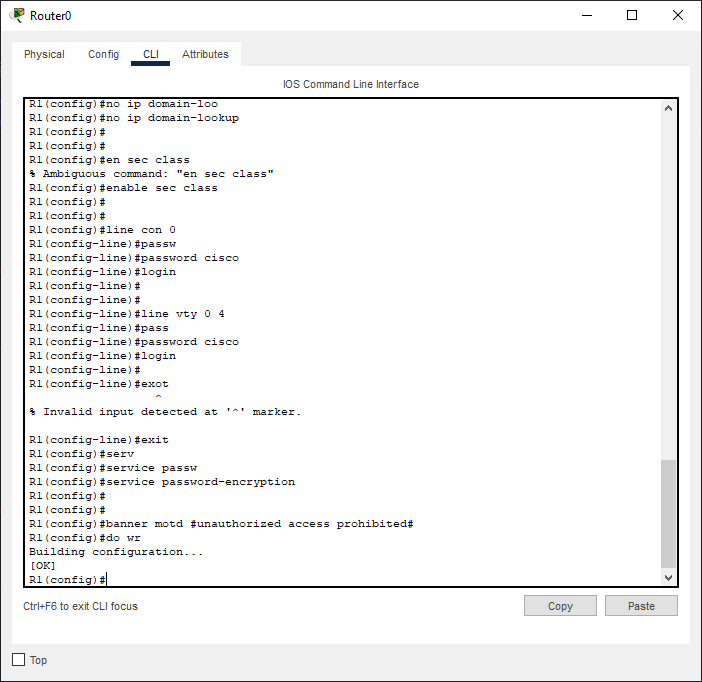

* Настройте на маршрутизаторе время.

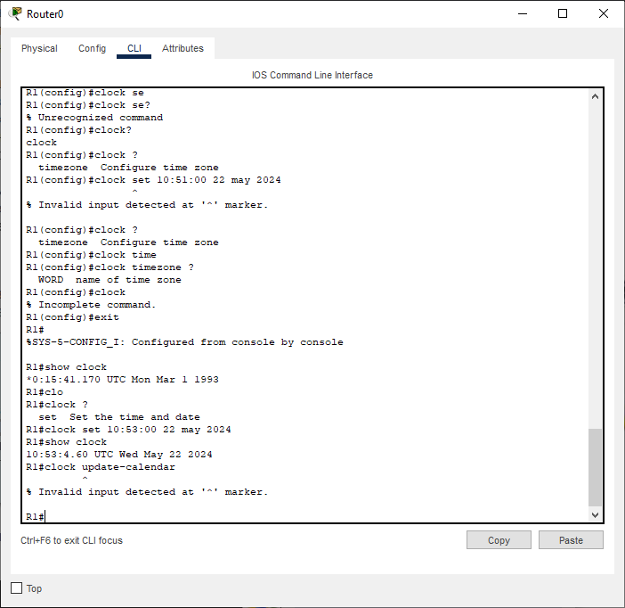

## Шаг 3. Настройте базовые параметры каждого коммутатора.

Настройка выполненна анологично настройке маршрутизатора

## Шаг 4. Настройте узлы ПК.

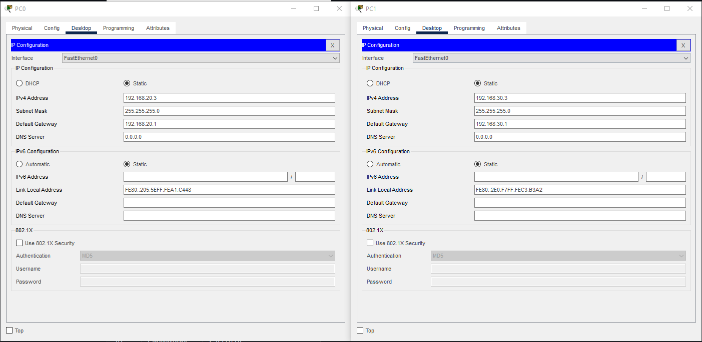

# Часть 2. Создание сетей VLAN и назначение портов коммутатора

## Шаг 1. Создайте сети VLAN на коммутаторах.

* Создайте и назовите необходимые VLAN на каждом коммутаторе из таблицы выше.

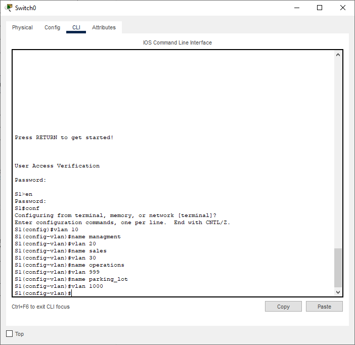

* Настройте интерфейс управления и шлюз по умолчанию на каждом коммутаторе, используя информацию об IP-адресе в таблице адресации.

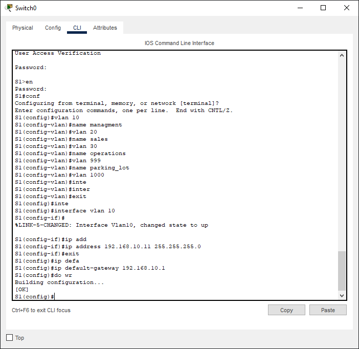

* Назначьте все неиспользуемые порты коммутатора VLAN Parking_Lot, настройте их для статического режима доступа и административно деактивируйте их.

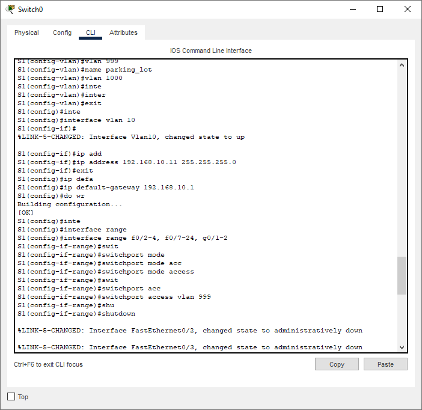

## Шаг 2. Назначьте сети VLAN соответствующим интерфейсам коммутатора.

* Назначьте используемые порты соответствующей VLAN (указанной в таблице VLAN выше) и настройте их для режима статического доступа.

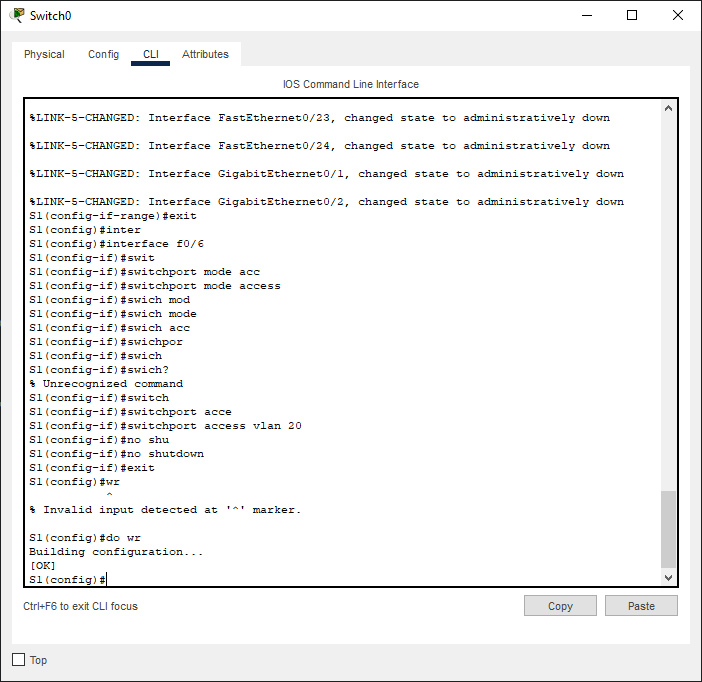

* Убедитесь, что VLAN назначены на правильные интерфейсы.

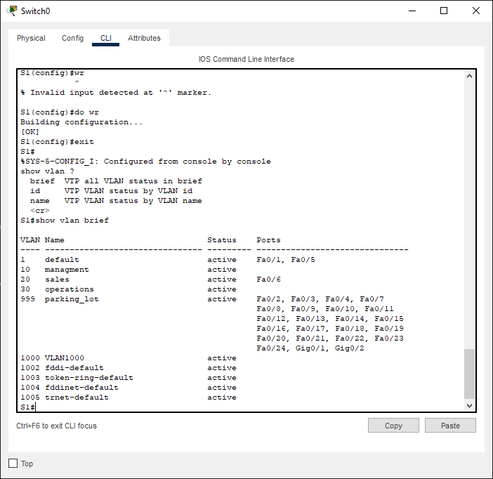

Выше представлена настройка коммутатора S1, коммутатор S2 настроен аналогично.

# Часть 3. Конфигурация магистрального канала стандарта 802.1Q между коммутаторами

## Шаг 1. Вручную настройте магистральный интерфейс F0/1 на коммутаторах S1 и S2.

* Настройка статического транкинга на интерфейсе F0/1 для обоих коммутаторов.

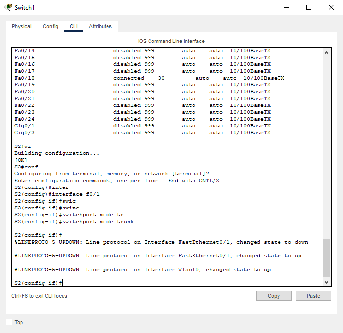

* Установите native VLAN 1000 на обоих коммутаторах.

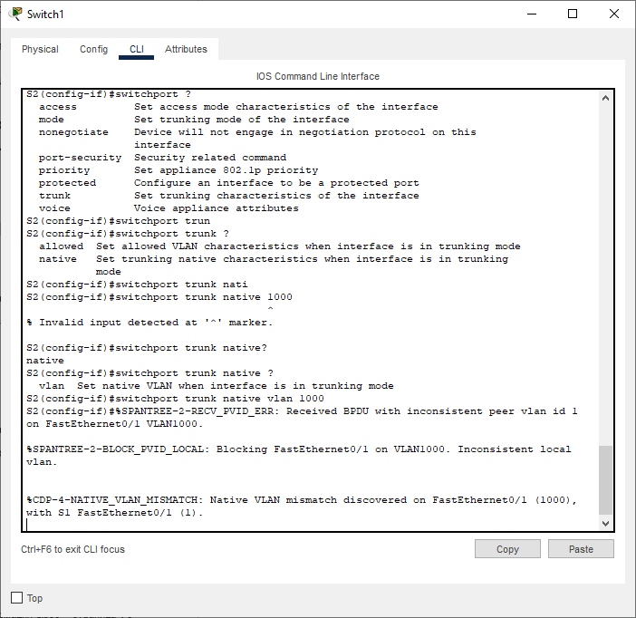

* Укажите, что VLAN 10, 20, 30 и 1000 могут проходить по транку.

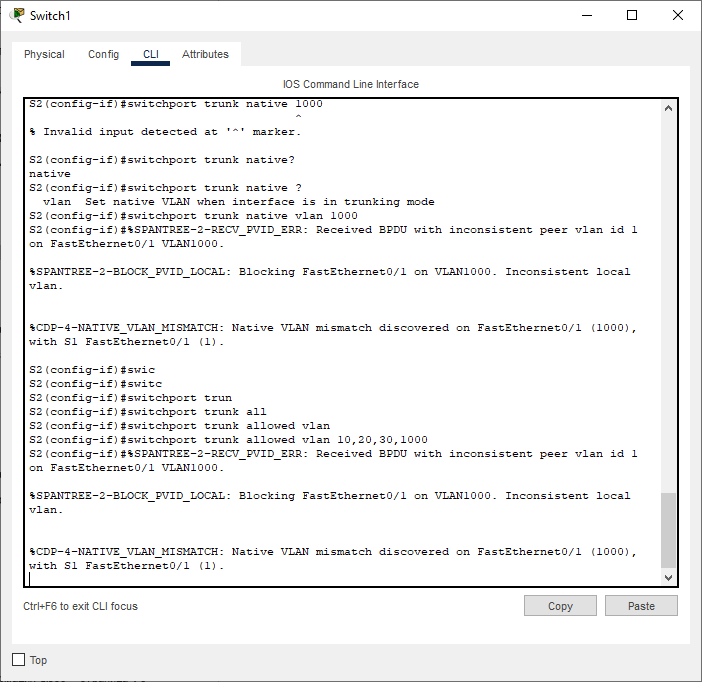

* Проверьте транки, native VLAN и разрешенные VLAN через транк.

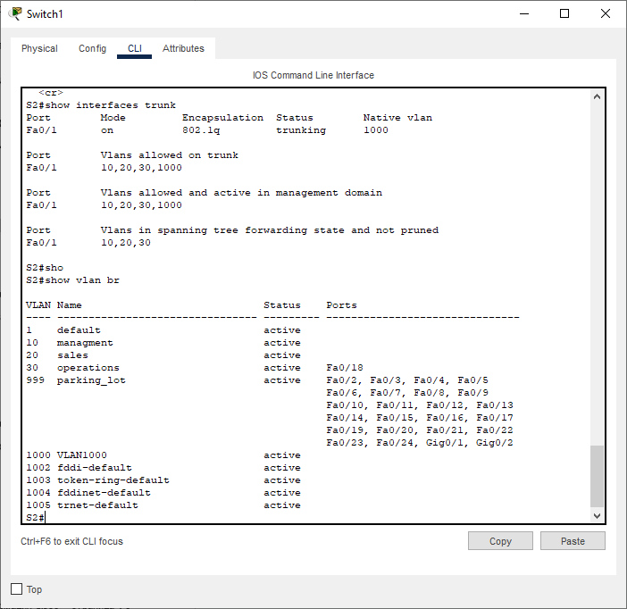

Выше представлена настройка коммутатора S1, коммутатор S2 настроен аналогично.

# Шаг 2. Вручную настройте магистральный интерфейс F0/5 на коммутаторе S1.

* Настройте интерфейс S1 F0/5 с теми же параметрами транка, что и F0/1. Это транк до маршрутизатора.

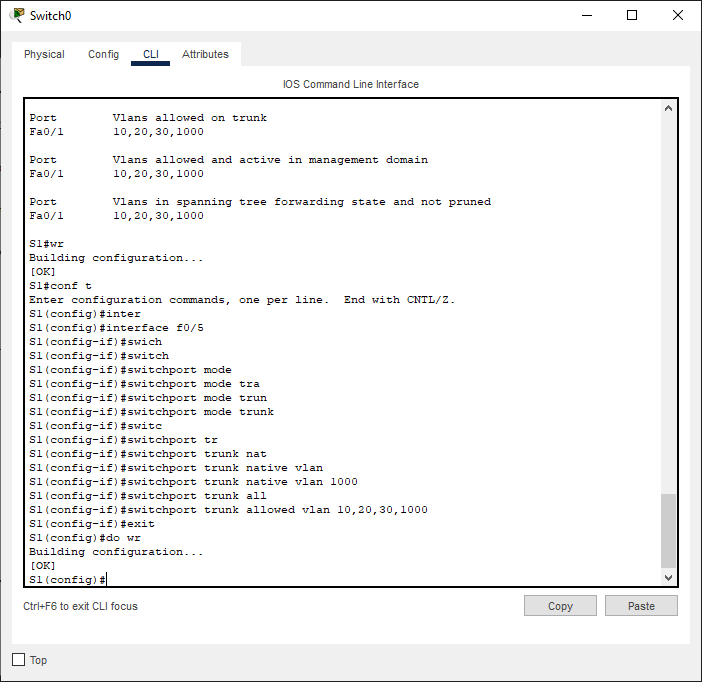
