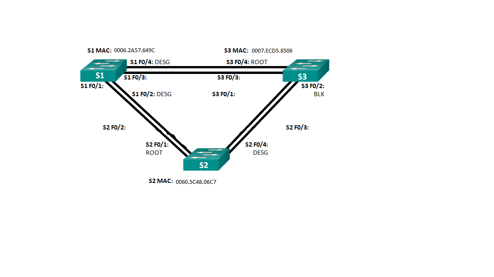
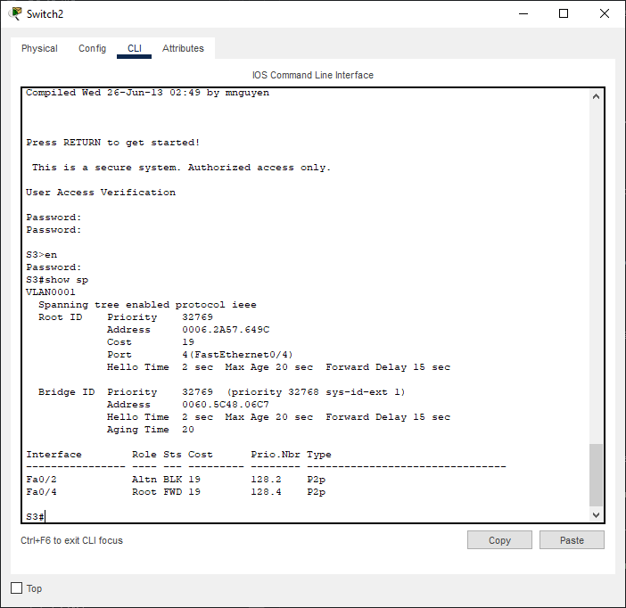
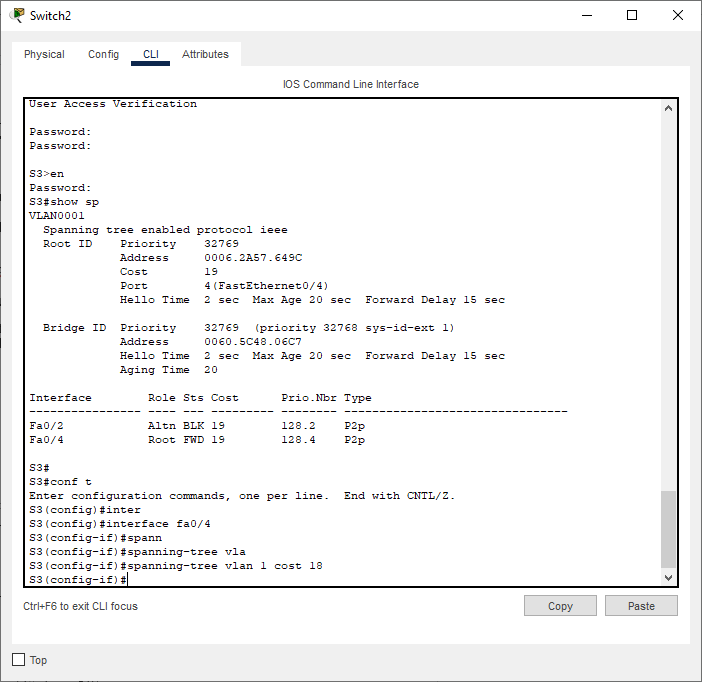
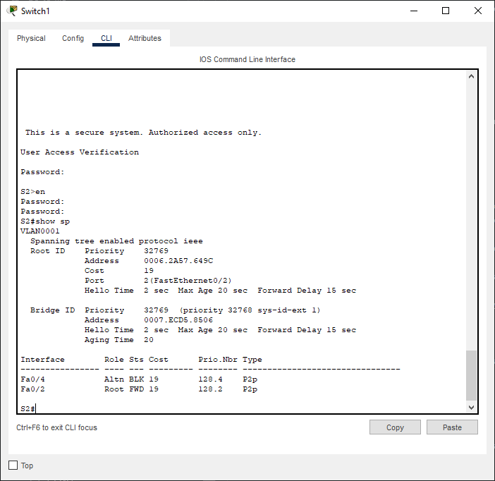
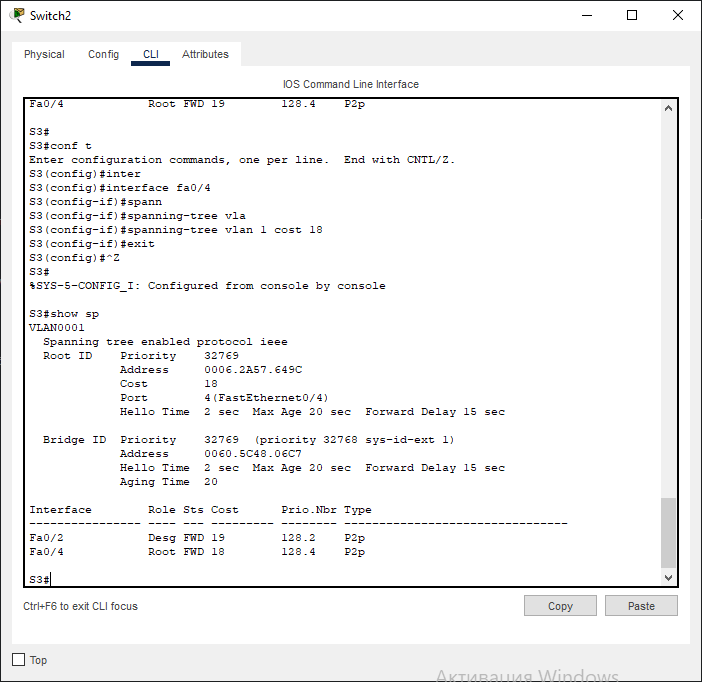
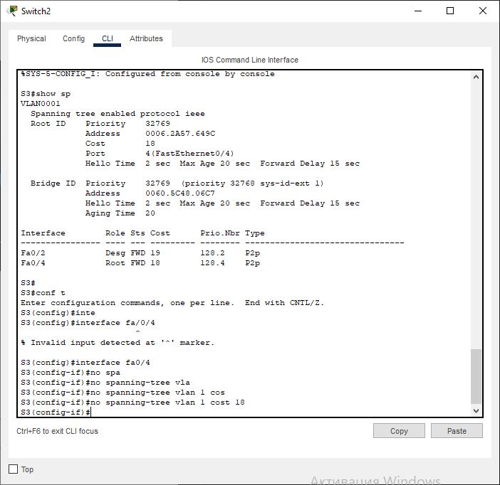
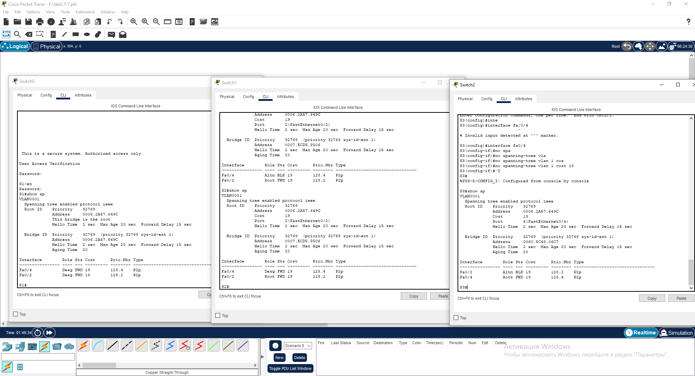
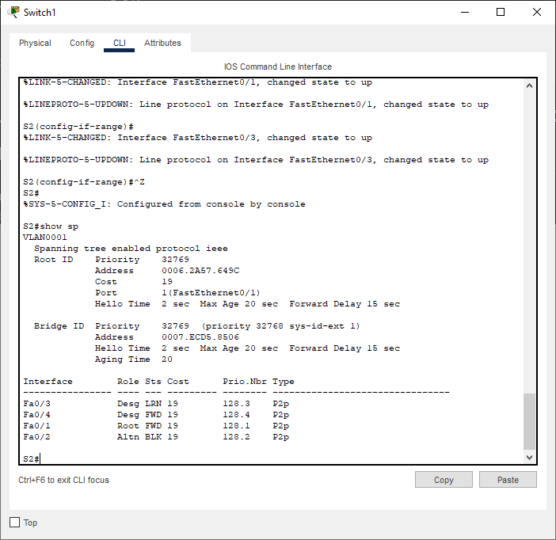
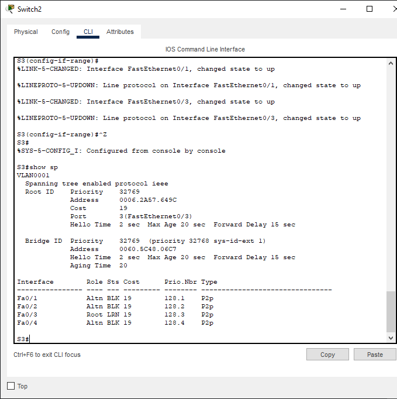

# Лабораторная работа. Развертывание коммутируемой сети с резервными каналами

## Топология

## Таблица адресации

| Устройство    | Интерфейс   | IP-адрес  | Маска подсети 
|-----------------|---------------|-------------------------|-------------------|
| S1 | VLAN 1  | 192.168.1.1  |   255.255.255.0   |
| S2 | VLAN 1  | 192.168.1.2 |    255.255.255.0  |
| S3 | VLAN 1  | 192.168.1.3 |    255.255.255.0  | 

### Задачи

Часть 1. Создание сети и настройка основных параметров устройства

Часть 2. Выбор корневого моста

Часть 3. Наблюдение за процессом выбора протоколом STP порта, исходя из стоимости портов

Часть 4. Наблюдение за процессом выбора протоколом STP порта, исходя из приоритета портов

## Решение

# Часть 1. Создание сети и настройка основных параметров устройства

## Шаг 1. Создайте сеть согласно топологии.

## Шаг 2. Настройте базовые параметры каждого коммутатора.

* Отключите поиск DNS

* Присвойте имена устройствам в соответствии с топологией.

* Назначьте class в качестве зашифрованного пароля доступа к привилегированному режиму.

* Назначьте cisco в качестве паролей консоли и VTY и активируйте вход для консоли и VTY каналов.

* Настройте logging synchronous для консольного канала.

* Настройте баннерное сообщение дня (MOTD) для предупреждения пользователей о запрете несанкционированного доступа.

* Задайте IP-адрес, указанный в таблице адресации для VLAN 1 на всех коммутаторах.

* Скопируйте текущую конфигурацию в файл загрузочной конфигурации.

## Шаг 3. Проверьте связь.

* Успешно ли выполняется эхо-запрос от коммутатора S1 на коммутатор S2?

* Успешно ли выполняется эхо-запрос от коммутатора S1 на коммутатор S3?

* Успешно ли выполняется эхо-запрос от коммутатора S2 на коммутатор S3?

# Часть 2. Определение корневого моста

## Шаг 1. Отключите все порты на коммутаторах.

## Шаг 2. Настройте подключенные порты в качестве транковых.

## Шаг 3. Включите порты F0/2 и F0/4 на всех коммутаторах.

## Шаг 4. Отобразите данные протокола spanning-tree.

Опираясь на схему приведенную выше видно, что корневым мостом является коммутатор s1. Произошло это из-за того что все три коммутатора имеют равные значения приоритета идентификатора моста следовательно, коммутатор с самым низким значением MAC-адреса становится корневым мостом.

# Часть 3. Наблюдение за процессом выбора протоколом STP порта, исходя из стоимости портов

## Шаг 1. Определите коммутатор с заблокированным портом.

С помощью команды show spanning-tree на коммутаторе S3 определим корневой и заблокированный порт: 

Порт Fa0/4 является корневым, порт Fa0/2 - заблокированными. 

## Шаг 2. Измените стоимость порта.

## Шаг 3. Просмотрите изменения протокола spanning-tree.

После изменений приоритета видно, что топология протокола перестроилась и порт Fa0/2 стал назначенным. Так же заметно, что на коммутаторе S2 стал заблокированным порт Fa0/4. Так произошло, потому что из сегмента сети между S2 и S3 теперь стоимость пути до S1 меньше через S3.

## ШАг 4. Удалите изменения стоимости порта.

# Часть 4. Наблюдение за процессом выбора протоколом STP порта, исходя из приоритета портов

После активации портов Fa0/1 и Fa0/3, протокол STP перестроил топологию. Теперь на коммутаторе S2 порта Fa0/1 стал корневым, а Fa0/2 - заблокирован.

На коммутаторе S3 порт Fa0/3 стал корневым, а Fa0/4 - заблокирован.

Так произошло, потому что протокол выбрал порт с наименьшим значение - корневым.
