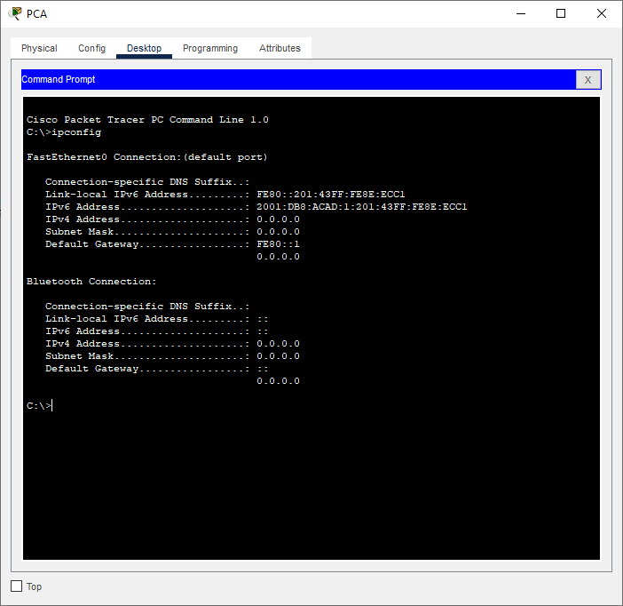

# Лабраторная работа - Настройка DHCPv6

## Топопология

## Таблица адресации

| Устройство    | Интерфейс   | IPv6-адрес  |
|-----------------|---------------|-------------------------|
| R1 | G0/0/0   | 2001:db8:acad:2::1/64  |   
| R1 | G0/0/0   | fe80::1 |  
| R1 | G0/0/1   | 2001:db8:acad:1::1/64  |   
| R1 | G0/0/1   | fe80::1 |  
| R2 | G0/0/0   | 2001:db8:acad:2::2/64|    
| R2 | G0/0/0   | fe80::2|
| R2 | G0/0/1   | 2001:db8:acad:3::1/64|    
| R2 | G0/0/1   | fe80::1 |
| PC-A | NIC    | DHCP |    
| PC-B | NIC    | DHCP |   

### Задачи

Часть 1. Создание сети и настройка основных параметров устройства

Часть 2. Проверка назначения адреса SLAAC от R1

Часть 3. Настройка и проверка сервера DHCPv6 без гражданства на R1

Часть 4. Настройка и проверка состояния DHCPv6 сервера на R1

Часть 5. Настройка и проверка DHCPv6 Relay на R2

# Часть 1. Создание сети и настройка основных параметров устройства

## Шаг 1. Создайте сеть согласно топологии.

## Шаг 2. Произведите базовую настройку маршрутизаторов.

* Назначьте маршрутизатору имя устройства.

* Отключите поиск DNS, чтобы предотвратить попытки маршрутизатора неверно преобразовывать введенные команды таким образом, как будто они являются именами узлов.

* Назначьте class в качестве зашифрованного пароля привилегированного режима EXEC.

* Назначьте cisco в качестве пароля консоли и включите вход в систему по паролю.

* Назначьте cisco в качестве пароля VTY и включите вход в систему по паролю.

* Зашифруйте открытые пароли.

* Создайте баннер с предупреждением о запрете несанкционированного доступа к устройству.

* Активация IPv6-маршрутизации

* Сохраните текущую конфигурацию в файл загрузочной конфигурации.

## Шаг 3. Настройка интерфейсов и маршрутизации для обоих маршрутизаторов.

* Настройте интерфейсы G0/0/0 и G0/1 на R1 и R2 с адресами IPv6, указанными в таблице выше.

* Настройте маршрут по умолчанию на каждом маршрутизаторе, который указывает на IP-адрес G0/0/0 на другом маршрутизаторе.

* Убедитесь, что маршрутизация работает с помощью пинга адреса G0/0/1 R2 из R1

* Сохраните текущую конфигурацию в файл загрузочной конфигурации.

# Часть 2. Проверка назначения адреса SLAAC от R1

* Откуда взялась часть адреса с идентификатором хоста?

Ответ будет зависеть от конфигурации операционной системы. Либо хост генерирует адрес EUI-64 на основе MAC-адреса интерфейса, либо случайный 64-битный адрес.

# Часть 3. Настройка и проверка сервера DHCPv6 на R1

## Шаг 1. Более подробно изучите конфигурацию PC-A.

* Выполните команду ipconfig /all на PC-A и посмотрите на результат.

## Шаг 2. Настройте R1 для предоставления DHCPv6 без состояния для PC-A.

* Создайте пул DHCP IPv6 на R1 с именем R1-STATELESS. В составе этого пула назначьте адрес DNS-сервера как 2001:db8:acad: :1, а имя домена — как stateless.com.

* Настройте интерфейс G0/0/1 на R1, чтобы предоставить флаг конфигурации OTHER для локальной сети R1 и укажите только что созданный пул DHCP в качестве ресурса DHCP для этого интерфейса.

* Проверьте вывод ipconfig /all и обратите внимание на изменения.

* Тестирование подключения с помощью пинга IP-адреса интерфейса G0/1 R2.

# Часть 4. Настройка сервера DHCPv6 с сохранением состояния на R1

* Создайте пул DHCPv6 на R1 для сети 2001:db8:acad:3:aaa::/80. Это предоставит адреса локальной сети, подключенной к интерфейсу G0/0/1 на R2. В составе пула задайте DNS-сервер 2001:db8:acad: :254 и задайте доменное имя STATEFUL.com.

* Назначьте только что созданный пул DHCPv6 интерфейсу g0/0/0 на R1.

# Часть 5. Настройка и проверка ретрансляции DHCPv6 на R2.

## Шаг 1. Включите PC-B и проверьте адрес SLAAC, который он генерирует.

## Шаг 2. Настройте R2 в качестве агента DHCP-ретрансляции для локальной сети на G0/0/1.

* Настройте команду ipv6 dhcp relay на интерфейсе R2 G0/0/1, указав адрес назначения интерфейса G0/0/0 на R1. Также настройте команду managed-config-flag

Команда ipv6 dhcp relay не поддерживаеться Cisco Packet Tracer !
