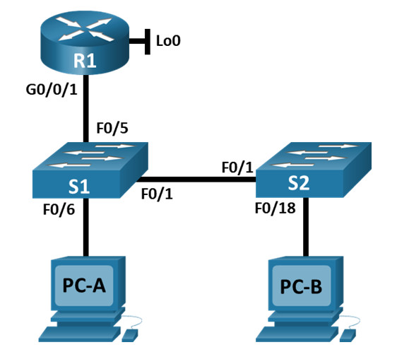
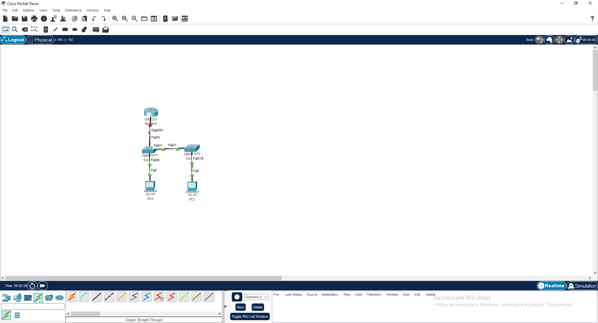
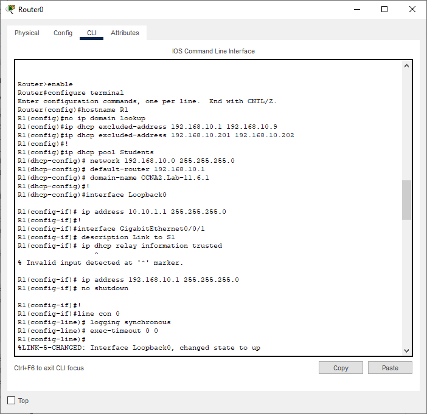
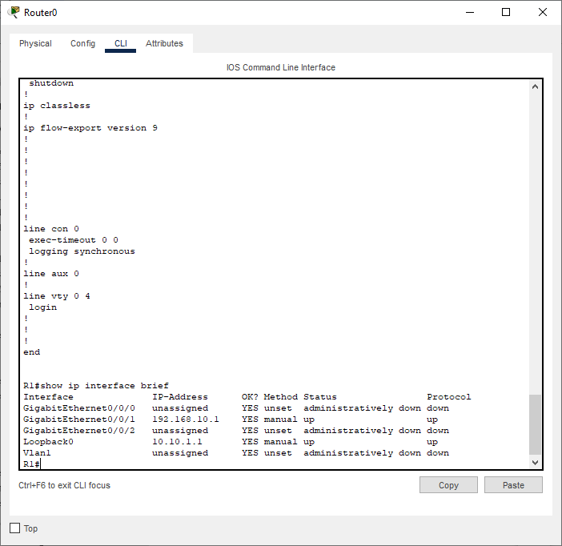
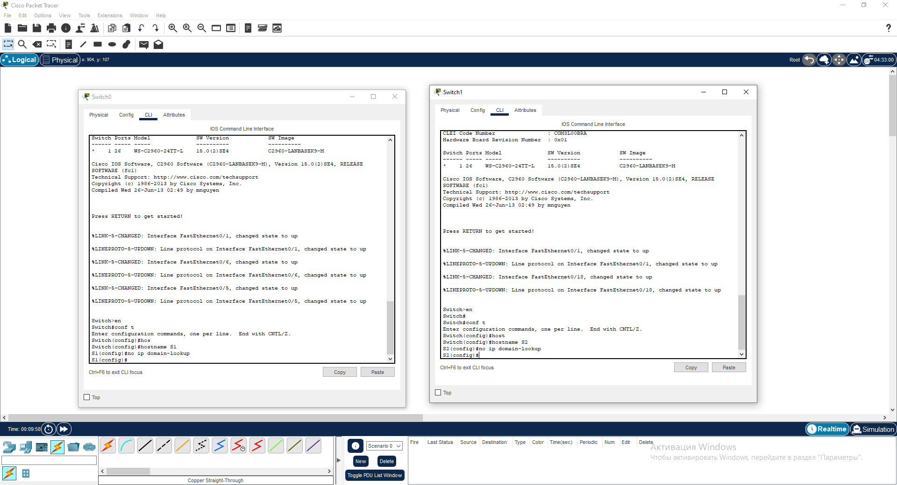
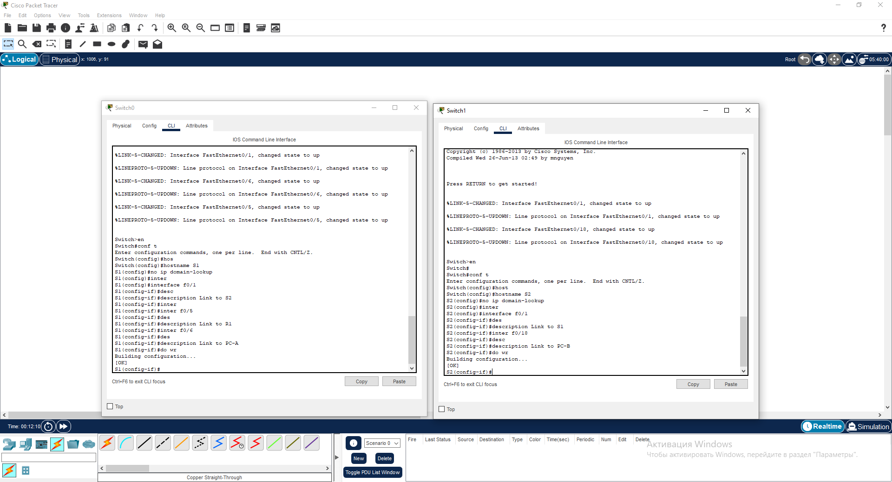
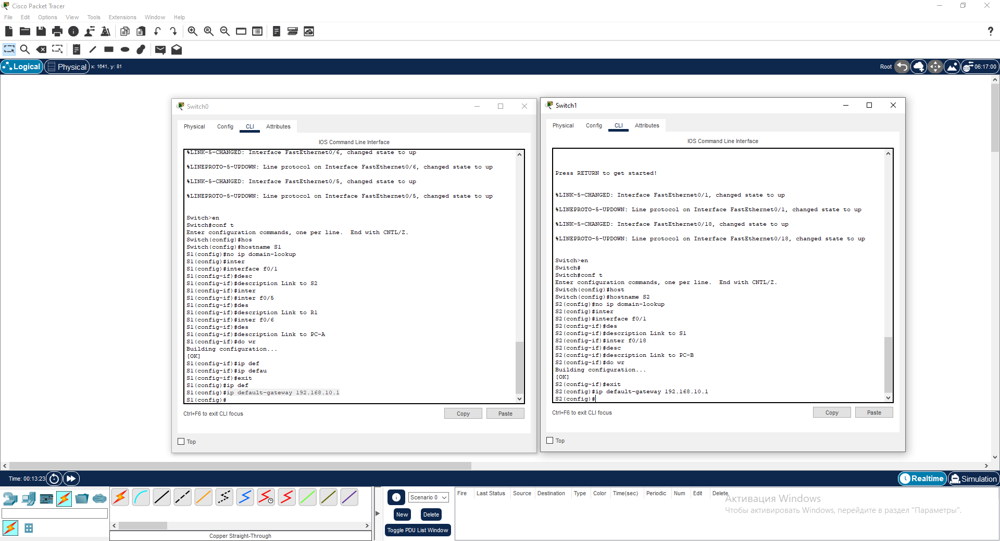

# Лабораторная работа - Конфигурация безопасности коммутатора

## Топопология

## Таблица адресации

| Устройство    | interface/vlan   | IP-адрес  | Маска подсети |
|-----------------|---------------|-------------------------|-------------------|
| R1 | G0/0/1   | 192.168.10.1  |   255.255.255.0   | 
| R1 | Loopback 0    | 10.10.1.1 |    255.255.255.0  | 
| S1 | VLAN 10   | 192.168.10.201|    255.255.255.0  | 
| S2 | VLAN 10 | 192.168.10.202 |    255.255.255.0   | 
| PC-A | NIC      | DHCP|    255.255.255.0  | 
| PC-B | NIC      | DHCP |    255.255.255.0  | 

### Задачи

Часть 1. Настройка основного сетевого устройства

Часть 2. Настройка сетей VLAN

Часть 3: Настройки безопасности коммутатора.

## Решение

# Часть 1. Настройка основного сетевого устройства

## Шаг 1. Создайте сеть.

* Создайте сеть согласно топологии.

## Шаг 2. Настройте маршрутизатор R1.

* Проверьте текущую конфигурацию на R1

## Шаг 3. Настройка и проверка основных параметров коммутатора

* Настройте имя хоста для коммутаторов S1 и S2.

* Запретите нежелательный поиск в DNS.

* Настройте описания интерфейса для портов, которые используются в S1 и S2.

* Установите для шлюза по умолчанию для VLAN управления значение 192.168.10.1 на обоих коммутаторах.

