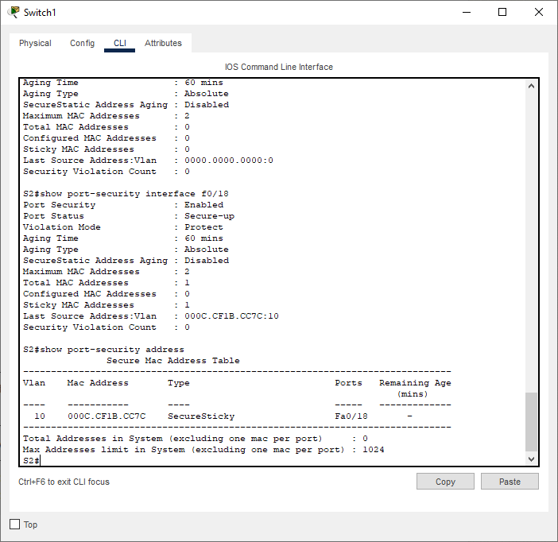
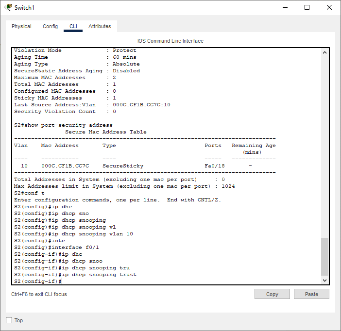

# Лабораторная работа - Конфигурация безопасности коммутатора

## Топопология

## Таблица адресации

| Устройство    | interface/vlan   | IP-адрес  | Маска подсети |
|-----------------|---------------|-------------------------|-------------------|
| R1 | G0/0/1   | 192.168.10.1  |   255.255.255.0   | 
| R1 | Loopback 0    | 10.10.1.1 |    255.255.255.0  | 
| S1 | VLAN 10   | 192.168.10.201|    255.255.255.0  | 
| S2 | VLAN 10 | 192.168.10.202 |    255.255.255.0   | 
| PC-A | NIC      | DHCP|    255.255.255.0  | 
| PC-B | NIC      | DHCP |    255.255.255.0  | 

### Задачи

Часть 1. Настройка основного сетевого устройства

Часть 2. Настройка сетей VLAN

Часть 3: Настройки безопасности коммутатора.

## Решение

# Часть 1. Настройка основного сетевого устройства

## Шаг 1. Создайте сеть.

* Создайте сеть согласно топологии.

## Шаг 2. Настройте маршрутизатор R1.

* Проверьте текущую конфигурацию на R1

## Шаг 3. Настройка и проверка основных параметров коммутатора

* Настройте имя хоста для коммутаторов S1 и S2.

* Запретите нежелательный поиск в DNS.

* Настройте описания интерфейса для портов, которые используются в S1 и S2.

* Установите для шлюза по умолчанию для VLAN управления значение 192.168.10.1 на обоих коммутаторах.

# Часть 2. Настройка сетей VLAN на коммутаторах.

## Шаг 1. Сконфигруриуйте VLAN 10.

## Шаг 2. Сконфигруриуйте SVI для VLAN 10.

## Шаг 3. Настройте VLAN 333 с именем Native на S1 и S2.

## Шаг 4. Настройте VLAN 999 с именем ParkingLot на S1 и S2.

# Часть 3. Настройки безопасности коммутатора.

## Шаг 1. Релизация магистральных соединений 802.1Q.

* Настройте все магистральные порты Fa0/1 на обоих коммутаторах для использования VLAN 333 в качестве native VLAN.

* Убедитесь, что режим транкинга успешно настроен на всех коммутаторах.

* Отключить согласование DTP F0/1 на S1 и S2.

* Проверьте с помощью команды show interfaces.

## Шаг 2. Настройка портов доступа

* На S1 настройте F0/5 и F0/6 в качестве портов доступа и свяжите их с VLAN 10.

* На S2 настройте порт доступа Fa0/18 и свяжите его с VLAN 10.

## Шаг 3. Безопасность неиспользуемых портов коммутатора

* На S1 и S2 переместите неиспользуемые порты из VLAN 1 в VLAN 999 и отключите неиспользуемые порты.

* Убедитесь, что неиспользуемые порты отключены и связаны с VLAN 999

## Шаг 4. Документирование и реализация функций безопасности порта.

* На S1, введите команду show port-security interface f0/6  для отображения настроек по умолчанию безопасности порта для интерфейса F0/6. Запишите свои ответы ниже.

| Функция    | Настройка по умолчанию   | 
|-----------------|---------------|
| Защита портов | Disabled   |  
| Максимальное количество записей MAC-адресов | 1  |  
| Режим проверки на нарушение безопасности | Shutdown   | 
| Aging Time | 0 mins | 
| Aging Type | Absolute      | 
| Secure Static Address Aging | Disabled      | 
| Sticky MAC Address | 0      | 

* На S1 включите защиту порта на F0 / 6 со следующими настройками:
  
Максимальное количество записей MAC-адресов: 3

Режим безопасности: restrict

Aging time: 60 мин.

Aging type: неактивный

* Проверьте безопасность порта F0/6 на S1

* Включите безопасность порта для F0 / 18 на S2. Настройте каждый активный порт доступа таким образом, чтобы он автоматически добавлял адреса МАС, изученные на этом порту, в текущую конфигурацию.

* Настройте следующие параметры безопасности порта на S2 F / 18:

Максимальное количество записей MAC-адресов: 2

Тип безопасности: Protect

Aging time: 60 мин.

* Проверка функции безопасности портов на S2 F0/18.

## Шаг 5. Реализовать безопасность DHCP snooping.

* На S2 включите DHCP snooping и настройте DHCP snooping во VLAN 10.

* Настройте магистральные порты на S2 как доверенные порты.

* Ограничьте ненадежный порт Fa0/18 на S2 пятью DHCP-пакетами в секунду.

* Проверка DHCP Snooping на S2.

* В командной строке на PC-B освободите, а затем обновите IP-адрес.

* Проверьте привязку отслеживания DHCP с помощью команды show ip dhcp snooping binding.

## Шаг 6. Реализация PortFast и BPDU Guard

* Настройте PortFast на всех портах доступа, которые используются на обоих коммутаторах.

* Включите защиту BPDU на портах доступа VLAN 10 S1 и S2, подключенных к PC-A и PC-B.

* Убедитесь, что защита BPDU и PortFast включены на соответствующих портах.

## Шаг 7. Проверьте наличие сквозного подключения.

